# Лабораторная работа №3

**Отчёт по дисциплине:** "Информационные технологии"

**Работу выполнил:** студент 3 курса группы ИС-23 Киселёв Иван

**Среда выполнения:** Debian (WSL2), Docker Desktop (Latest on 20.11.25)

---

### 1. Установка и настройка Docker и Docker Compose. Создание и публикация кастомного образа Nginx

Для выполнения лабораторной работы использовалась рабочая станция под управлением  **Windows 11** , на которой установлена среда **WSL2 (Windows Subsystem for Linux)** с дистрибутивом  **Debian.**

Установка Docker Engine и Docker Compose Plugin напрямую через пакетный менеджер `apt` в Debian оказалась невозможной из-за несовместимости версий (trixie) с официальным репозиторием Docker. В связи с этим было принято решение использовать **Docker Desktop для Windows** как основной инструмент управления контейнерами.

**Docker Desktop** был установлен на хостовую систему Windows. В его настройках активирована интеграция с WSL2, что позволяет запускать контейнеры непосредственно из терминала Debian в WSL. Таким образом, все команды *docker* и *docker compose*, выполняемые в WSL, фактически перенаправляются на Docker Engine, работающий в контексте Docker Desktop на Windows.

Проверка работоспособности выполнена командой:

```bash
docker run hello-world
```

Команда успешно вывела диагностическое сообщение, подтвердив корректную работу Docker Engine.

На платформе [Docker Hub ](https://hub.docker.com/)была создана учётная запись с логином `valder111`.
После входа в аккаунт через веб-интерфейс был создан [публичный репозиторий](https://hub.docker.com/repository/docker/valder111/custom-nginx/general) с именем `custom-nginx`.

Образ `nginx:1.21.1` был скачан с Docker Hub командой:

```bash
docker pull nginx:1.21.1
```

Вывод подтверждает успешную загрузку:

```bash
1.21.1: Pulling from library/nginx 
Digest: sha256:f1e9e5f5e8a8a8e8e8e8e8e8e8e8e8e8e8e8e8e8e8e8e8e8e8e8e8e8e8e8e8e8
Status: Downloaded newer image for nginx:1.21.1
docker.io/library/nginx:1.21.1
```

В директории `/home/wValder/custom-nginx-project` были созданы два файла.

**Файл `index.html`:**

```html
<html>
<head>
Hey, ZGU!
</head>
<body>
<p>I will be IT Engineer!</p>
</body>
</html>
```

**Файл `Dockerfile`:**

```
FROM nginx:1.21.1
COPY index.html /usr/share/nginx/html/index.html
```

Образ был собран с тегом `1.0.0`. Затем образ был запушен в удалённый репозиторий:

```bash
docker build -t valder111/custom-nginx:1.0.0 .
docker push valder111/custom-nginx:1.0.0
```

Созданный образ доступен в публичном репозитории Docker Hub по адресу:

[https://hub.docker.com/r/valder111/custom-nginx](https://hub.docker.com/r/valder111/custom-nginx)

### 2. Запуск и анализ контейнера

Согласно условиям задачи, был запущен контейнер из ранее собранного образа `valder111/custom-nginx:1.0.0`. Контейнер был запущен в **фоновом режиме** (`-d`), с **именем** `KiselevIvanMikhailovich-custom-nginx-t2`, и с пробросом порта `127.0.0.1:8080` на порт `80` внутри контейнера.

```bash
docker run -d --name КиселёвИванМихайлович-custom-nginx-t2 -p 127.0.0.1:8080:80 valder111/custom-nginx:1.0.0
```

Эта команда создала и запустила контейнер, инициализировав Nginx внутри него.

Контейнер был переименован из `KiselevIvanMikhailovich-custom-nginx-t2` в `custom-nginx-t2` с помощью команды:

```bash
docker rename КиселёвИванМихайлович-custom-nginx-t2 custom-nginx-t2
```

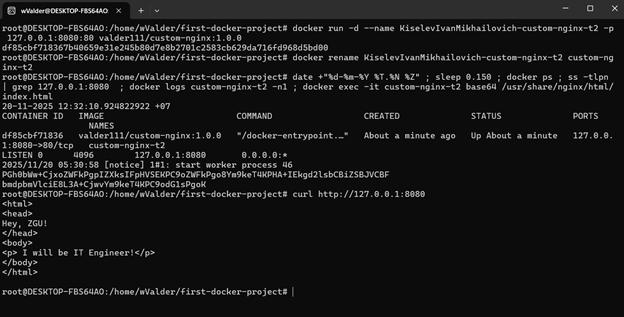

Для получения комплексной информации о системе и контейнере была выполнена следующая цепочка команд:

```bash
date +"%d-%m-%Y %T.%N %Z" ; sleep 0.150 ; docker ps ; ss -tlpn | grep 127.0.0.1:8080  ; docker logs custom-nginx-t2 -n1 ; docker exec -it custom-nginx-t2 base64 /usr/share/nginx/html/index.html
```

**Анализ вывода:**

1. `date +"%d-%m-%Y %T.%N %Z"`: Выводит точное время выполнения команды с наносекундами и часовым поясом.
2. **`sleep 0.150`** : Приостанавливает выполнение на 150 миллисекунд.
3. `docker ps`:

   ```
   CONTAINER ID   IMAGE                          COMMAND                  CREATED         STATUS         PORTS                    NAMES
   67c3468640ec   valder111/custom-nginx:1.0.0   "/docker-entrypoint.…"   6 minutes ago   Up 6 minutes   127.0.0.1:8080->80/tcp   custom-nginx-t2b
   ```

   Подтверждает, что контейнер `custom-nginx-t2` запущен и работает.
4. `ss -tlpn | grep 127.0.0.1:8080`: подтверждает, что порт 8080 на интерфейсе 127.0.0.1 (localhost) прослушивается системой, и соединения перенаправляются в контейнер:

   ```
   "LISTEN 0      4096        127.0.0.1:8080       0.0.0.0:*
   ```
5. `docker logs custom-nginx-t2 -n1`: Выводит последнюю строку лога Nginx, подтверждающую успешный запрос к корню `/`.
6. `docker exec -it custom-nginx-t2 base64 /usr/share/nginx/html/index.html`: Эта команда читает файл `index.html` внутри контейнера и выводит его содержимое в кодировке base64. Декодировав строку (например, `echo '...' | base64 -d`), можно убедиться, что это наш кастомный HTML-код.

   
7. Доступность веб-страницы была подтверждена двумя способами:

   1. **Использование `curl`** :

      `curl http://127.0.0.1:8080`

      **Вывод:**

      ```html
      <html>
      <head>
      Hey, ZGU!
      </head>
      <body>
      <p>I will be IT Engineer!</p>
      </body>
      </html>
      ```
   2. **Использование WEB-браузера на системе Windows 11**

      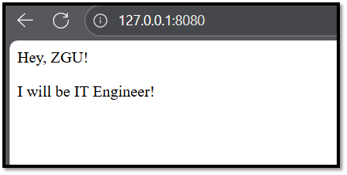

### 3. Анализ и модификация контейнера Nginx

Для подключения к стандартному потоку ввода/вывода (stdin/stdout/stderr) запущенного контейнера используется команда `docker attach`. Данная команда присоединяет текущий терминал к основному процессу внутри контейнера, позволяя взаимодействовать с ним напрямую.

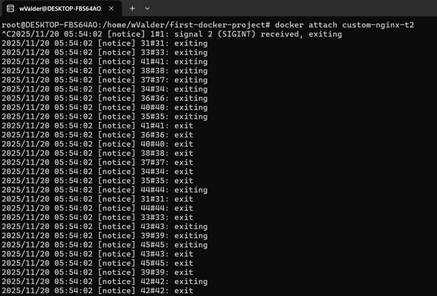

После подключения к контейнеру была нажата комбинация клавиш  **`Ctrl+C`** . Эта комбинация отправляет сигнал **`SIGINT`** (interrupt) текущему процессу, которому присоединён терминал, то есть к самому процессу `nginx`. Контейнер немедленно остановился. Вывод команды `docker ps` после этого показал, что контейнер `custom-nginx-t2` имеет статус `Exited`:

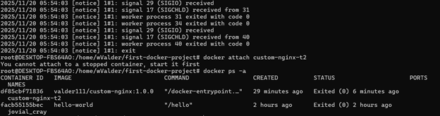

Для восстановления работы контейнера использована команда: `docker start custom-nginx-t2`

Для выполнения внутренних операций (установка редактора, редактирование конфигурации) было необходимо получить интерактивный доступ к файловой системе контейнера. Для этого использована команда: `docker exec -it custom-nginx-t2 bash`

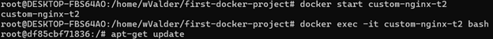

> **Примечание:** При попытке обновления возникла ошибка `404 Not Found` — это связано с тем, что **Debian 11** является **устаревшей (EOL)** версией, и её репозитории перемещены в архив.
> Для корректной работы были добавлены архивные репозитории:

```
echo "deb http://archive.debian.org/debian bullseye main" > /etc/apt/sources.list
echo "deb http://archive.debian.org/debian-security bullseye/updates main" >> /etc/apt/sources.list
apt-get update
```

**Установка nano:** `apt-get install -y nano`

Файл конфигурации Nginx, отвечающий за прослушивание портов, находится в `/etc/nginx/conf.d/default.conf`. Он был открыт в редакторе `nano`:

В файле `default.conf` строка `listen 80` заменена на `listen 81`:

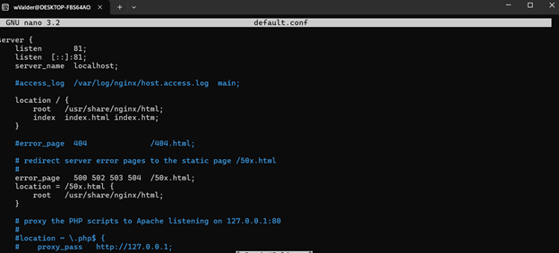

> Изменение порта с 80 на 81 имитирует сценарий, при котором администратор изменяет конфигурацию сервиса внутри контейнера. Это критично для понимания того, что  **порт, прослушиваемый сервисом, и порт, пробрасываемый Docker, - это разные сущности**

Для применения изменений без перезапуска контейнера использована команда: `nginx -s reload`

Повторный запрос `curl http://127.0.0.1:81` по новому порту успешно подтвердил нормальное функционирование контейнера

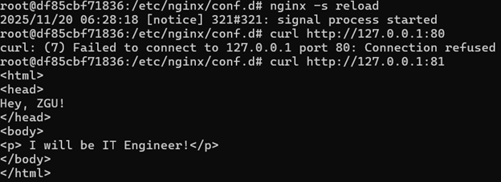

Неудачная проверка статуса `nginx` по старому порту `80` (как и неудачная поытка выполнения `curl` ) - очередное подтверждение "переезда" nginx-контейнера на новый порт `81`:

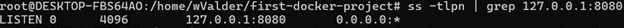

Для удаления запущенного контейнера использована команда с флагом `--force` (`-f`):

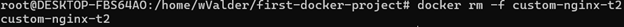

> Команда `docker rm` по умолчанию не может удалить запущенный контейнер. Флаг `-f` выполняет **принудительную остановку** (отправка `SIGKILL`) и последующее удаление.

### 4. Совместное использование данных между контейнерами через монтирование томов

Целью данной задачи является демонстрация механизма **совместного доступа к данным** между различными контейнерами и хост-системой с использованием **bind mounts** (привязанных томов).

Согласно условиям задачи, необходимо запустить контейнер из образа `centos`. Однако, образ `centos:latest` в настоящее время помечен как [deprecated](https://hub.docker.com/_/centos), не поддерживается и не рекомендуется к использованию. Вместо него был выбран альтернативный, широко используемый легковесный дистрибутив - **Alpine Linux**.

Контейнер `alpine-container` был запущен в фоновом режиме (`-d`) с монтированием текущего рабочего каталога хоста (`$(pwd)`) в директорию `/data` внутри контейнера:

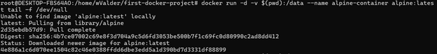

Аналогично был запущен второй контейнер на базе официального образа `debian`, также с монтированием той же директории хоста в `/data`:

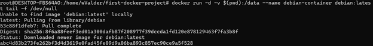

Для проверки записи в общую директорию была выполнена команда `docker exec` для контейнера `alpine-container`:

`docker exec -it alpine-container sh`

Эта команда:

* Подключается к контейнеру `alpine-container`.
* Использует оболочку `sh` (так как `bash` отсутствует в минимальном образе Alpine).

Внутри контейнера Alphine был создан файл "`text.txt`" в директории `/data`:

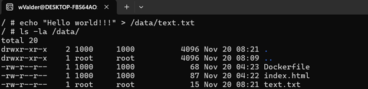

Для демонстрации двунаправленной синхронизации был создан файл "`host_text.txt`" непосредственно на хостовой системе (в терминале WSL):

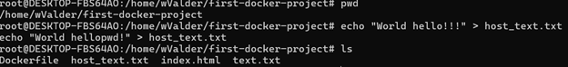

После успешного входа в Debian-контейнер мы убеждаемся, что в каталоге `/data` присутствуют все созданные файлы вне этого контейнера:

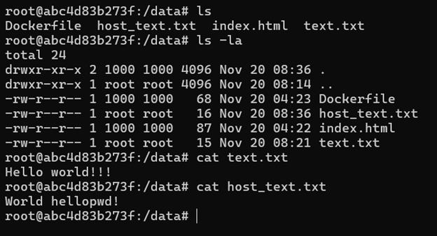

Результаты подтверждают корректную работу механизма bind mounts:

* Файл, созданный **изнутри первого контейнера** (`alpine-container`), стал доступен **во втором контейнере** (`debian-container`).
* Файл, созданный  **на хост-машине** , также стал доступен внутри второго контейнера.

### 5. Оркестрация с Docker Compose и локальный registry

Целью данной задачи является изучение возможностей **Docker Compose** для оркестрации  **многосервисных приложений** , включая:

* Запуск нескольких сервисов (локальный registry, Portainer) из разных файлов конфигурации.
* Использование директивы `include` для объединения конфигураций.
* Работа с локальным registry для хранения образов.
* Использование веб-интерфейса Portainer для управления контейнерами.
* Понимание приоритетов файлов Compose и поведения при их изменении.

Для изоляции проекта была создана отдельная директория: `/tmp/ZGU/docker/task`.

В этой директории были созданы два файла:

* compose.yaml
* docker-compose.yaml

**compose.yaml:**

```
version: "3"
services:
  portainer:
    network_mode: host
    image: portainer/portainer-ce:latest
    volumes:
      - /var/run/docker.sock:/var/run/docker.sock
```

**docker-compose.yaml**

```
version: "3"
services:
  registry:
    image: registry:2
    ports:
      - "5000:5000"
```

Команда `docker compose up -d` была выполнена в директории `/tmp/ZGU/docker/task`

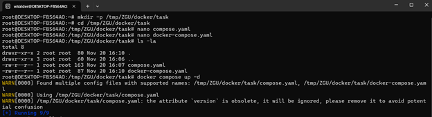

> Docker Compose обнаружил **два** файла с поддерживаемыми именами (`compose.yaml`, `docker-compose.yaml`). Согласно [документации ](https://docs.docker.com/compose/compose-application-model/#the-compose-file), приоритет имеют файлы в следующем порядке: `compose.yaml`, `compose.yml`, `docker-compose.yaml`, `docker-compose.yml`.
> Поэтому был использован  **`compose.yaml`** , и запущен **только** сервис `portainer`.
> Служба `registry`, определённая в `docker-compose.yaml`,  **не была запущена** .

Для запуска **обоих** сервисов (`registry` и `portainer`) в одном проекте, файл `compose.yaml` был отредактирован с использованием директивы `include`, как указано в [документации](https://docs.docker.com/compose/compose-file/14-include/):

```
name: 'zgu-task5-included'
include:docker-compose.yamlversion: "3"
services:
  portainer:
    image: portainer/portainer-ce:latest
    ports:
      - "9001:9000"  # Изменён порт для избежания конфликта
    volumes:
      - /var/run/docker.sock:/var/run/docker.sock
```

* `include: - docker-compose.yaml` указывает Compose загрузить и объединить определения из `docker-compose.yaml`.
* `name: 'zgu-task5-included'` задаёт имя проекта для ясности.
* `ports` вместо `network_mode: host` обеспечивает доступность portainer на хосте через проброс портов.

После редактирования файлов проект был перезапущен:

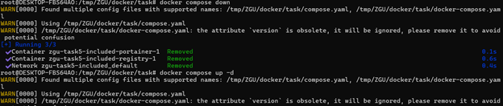

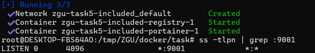

Оба сервиса (`registry` и `portainer`) успешно запущены в рамках одного проекта.

Для работы с локальным registry необходимо было разрешить Docker использовать небезопасный (insecure) registry по адресу `127.0.0.1:5000`. Это было сделано путём добавления конфигурации в `/etc/docker/daemon.json`:

```
{
  "insecure-registries": ["127.0.0.1:5000"]
}
```

После сохранения файла конфигурации демон Docker был перезапущен (`systemctl restart docker`)

Затем был перезапущен контейнер `registry`, чтобы изменения вступили в силу (`docker compose restart registry`)

Образ `valder111/custom-nginx:1.0.0` был помечен для загрузки в локальный registry. Он был успешно загружен (`pushed`) в локальный registry:

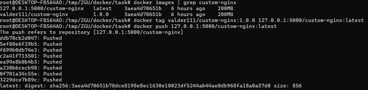

Portainer был доступен по адресу `http://127.0.0.1:9001` (порт изменён для избежания конфликта):

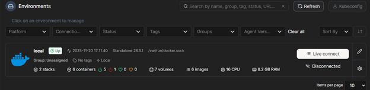

Через веб-интерфейс Portainer:

1. Перейдено в раздел  **Stacks**.
2. Нажата кнопка  **Add stack**.
3. В поле **Name** введено: `nginx-stack-from-local-registry`.
4. В **Web editor** вставлен следующий YAML:

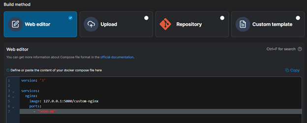

5. Нажата кнопка  **Deploy the stack**.

В `Stacks list` перечислены все отслеживаемые контейнерные сборки:

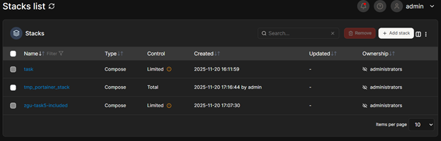

Через веб-интерфейс Portainer:

1. Перейдено в раздел  **Containers**.
2. Найден контейнер, связанный со стеком `nginx-stack-from-local-registry`.
3. Нажата кнопка  **Inspect**.
4. В представлении `Tree` развернут раздел `Config`.
5. Сделан скриншот от поля `AppArmorProfile` до поля `Driver`.

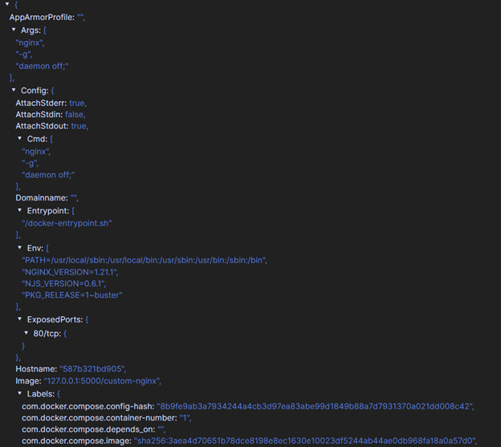

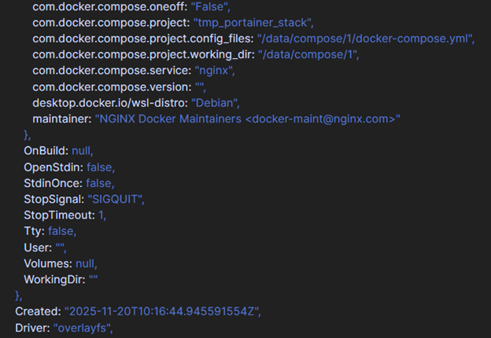

Один из файлов манифеста Compose (`compose.yaml`) был удалён. Команда (`docker compose up -d`) была выполнена снова. Было получено предупреждение:

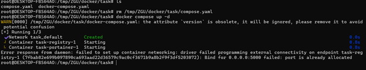

Docker Compose снова ищет файлы с поддерживаемыми именами. Несмотря на то, что `compose.yaml` был удалён, система всё ещё проверяет его наличие (или ищет другие). В данном случае, предупреждение указывает, что файл `docker-compose.yaml` найден и будет использован. Это происходит потому, что Docker Compose сканирует директорию и уведомляет о найденных файлах. Поскольку `compose.yaml` больше не существует, он просто игнорируется, и используется следующий подходящий файл в порядке приоритета, который теперь - `docker-compose.yaml`.

Проект был остановлен. А также удалены все связанные с ним ресурсы (контейнеры, сети) одной командой:

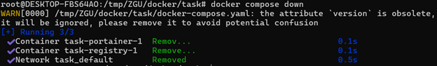

### Заключение

Лабораторная работа успешно выполнена: освоены контейнеризация, оркестрация через Docker Compose, работа с локальным registry и Portainer, а также принципы совместного использования данных и управления конфигурациями в изолированной среде.
