# Лабораторная работа 4: GitLab CI/CD и Nexus Repository Manager

**Работу выполнили:** Бородин Артём, Киcелёв Иван.
**Группа:** ИС-23

## Цель работы

Настройка взаимодействия между **GitLab** и **Nexus Repository Manager**, реализация полного DevOps-цикла для Python-приложения с автоматизацией тестирования, сборкой Docker-образа и публикацией в Docker-репозиторий.

### Задачи:

1. Настроить `docker-compose` для развёртывания GitLab и Nexus
2. Создать простое Python-приложение с модульными тестами
3. Настроить GitLab CI/CD для автоматического тестирования и сборки Docker-образов
4. Интегрировать процесс публикации образов в Nexus Repository Manager

---

## Задача 1: Подготовка окружения (GitLab + Nexus)

### Описание выполнения

Для развёртывания инфраструктуры использовался Docker Compose с конфигурацией, определяющей два основных сервиса: GitLab и Nexus Repository Manager.

### Содержимое docker-compose.yaml

```yaml
version: '3.8'

services:
  gitlab:
    image: gitlab/gitlab-ce:latest
    container_name: gitlab
    hostname: gitlab.local
    ports:
      - "8081:80"
      - "2222:22"
    volumes:
      - gitlab-config:/etc/gitlab
      - gitlab-logs:/var/log/gitlab
      - gitlab-data:/var/opt/gitlab
    environment:
      GITLAB_OMNIBUS_CONFIG: |
        external_url 'http://192.168.30.180:8081'
        nginx['listen_port'] = 80
        nginx['listen_https'] = false
    restart: always
    networks:
      - devops-net

  nexus:
    image: sonatype/nexus3:3.68.1
    container_name: nexus
    hostname: nexus.local
    ports:
      - "8082:8081"
      - "5000:5000"
    volumes:
      - nexus-data:/nexus-data
    environment:
      INSTALL4J_ADD_VM_PARAMS: "-Xms2g -Xmx2g -XX:MaxDirectMemorySize=2g"
    restart: always
    networks:
      - devops-net

networks:
  devops-net:
    driver: bridge

volumes:
  gitlab-config:
  gitlab-logs:
  gitlab-data:
  nexus-data:
```

### Результаты развёртывания

Сервисы успешно запущены с помощью команды:

```bash
docker compose up -d
```

Сервисы доступны по адресам:

- **GitLab**: `http://192.168.30.180:8081/`
- **Nexus**: `http://192.168.30.180:8082/`

### Рис1. Успешный запуск GitLab

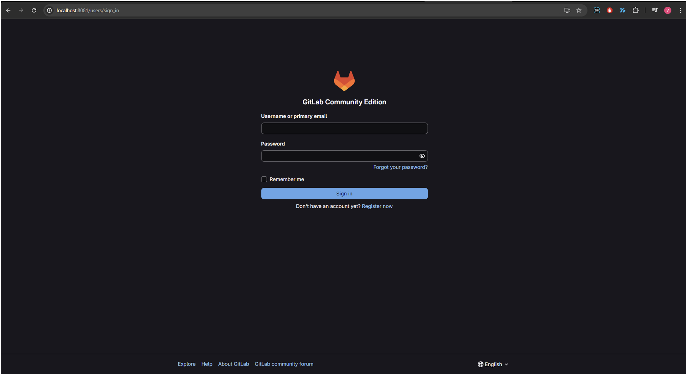

### Рис2. Успешный запуск Nexus

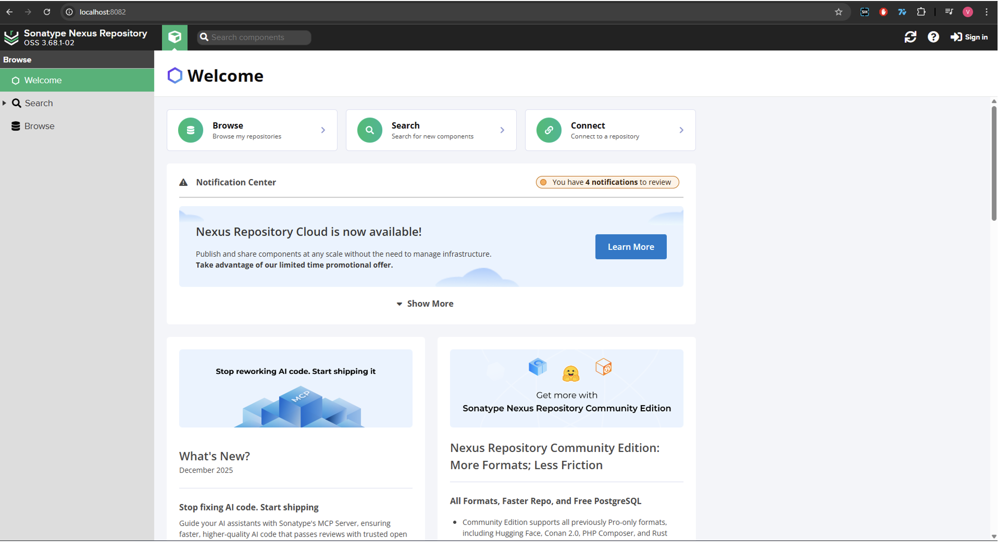

### Рис3. Содержимое docker-compose.yaml

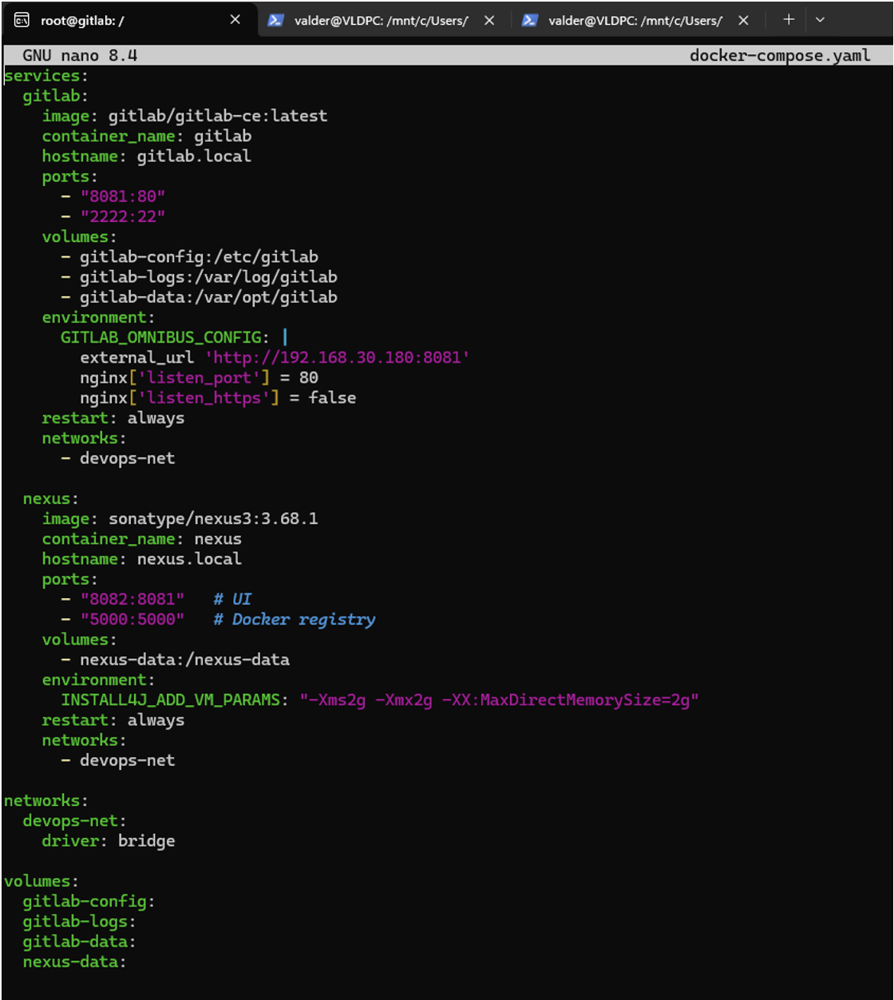

---

## Задача 2: Создание Python-приложения

### Описание

Разработано простое Python-приложение `text_tool.py`, реализующее операции работы с текстом. Приложение включает функции подсчёта количества слов и поиска самого длинного слова.

### Содержимое text_tool.py

```python
def count_words(text):
    """Подсчитывает количество слов в тексте."""
    return len(text.split())


def longest_word(text):
    """Находит самое длинное слово в тексте."""
    words = text.split()
    return max(words, key=len) if words else None
```

### Модульные тесты (test_text_tool.py)

```python
import pytest
from text_tool import count_words, longest_word


def test_count_words():
    assert count_words("Hello world") == 2
    assert count_words("") == 0


def test_longest_word():
    assert longest_word("Hello world") == "Hello"
    assert longest_word("") is None
```

### Зависимости (requirements.txt)

```text
pytest
```

### Структура полностью заполненного репозитория

```
project/
├── text_tool.py
├── test_text_tool.py
├── requirements.txt
├── Dockerfile
├── .gitlab-ci.yml
└── docker-compose.yaml
```

### Загрузка в GitLab

Приложение инициализировано как локальный Git-репозиторий и отправлено в GitLab с помощью команд:

```bash
git init
git add .
git commit -m "Описание коммита"
git remote add origin <gitlab-repository-url>
git push -u origin master
```

### Рис4. Локальный тест Python-программы


### Рис5. Создание репозитория в GitLab

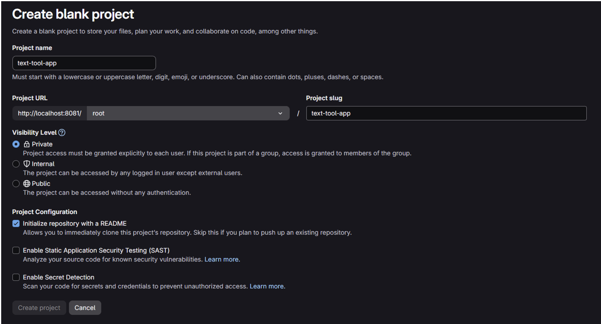

### Рис6. Первый коммит, направленный на созданный GitLab-репозиторий

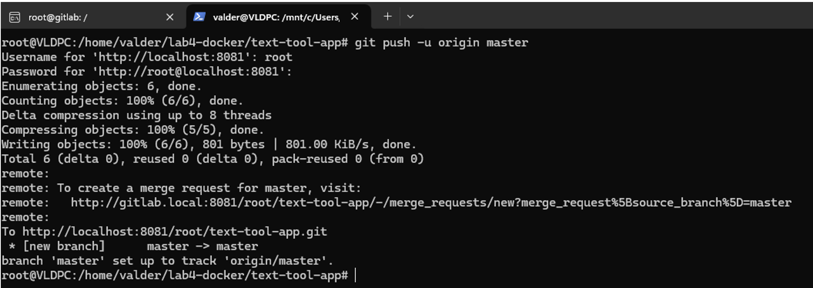

### Рис7. Содержимое GitLab репозитория

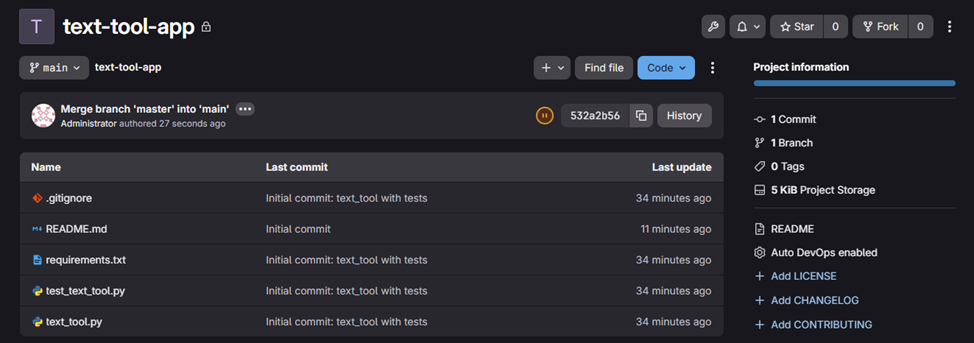

---

## Задача 3: GitLab CI/CD – Тестирование и Сборка Docker-образа

### 3.1 Этап тестирования

Создан файл `.gitlab-ci.yml` с определением пайплайна, содержащего два этапа: `test` и `build_and_push`.

### Содержимое .gitlab-ci.yml

```yaml
stages:
  - test
  - build

variables:
  DOCKER_REGISTRY: "nexus:5000"
  DOCKER_IMAGE: "$DOCKER_REGISTRY/python-lab"
  PIP_CACHE_DIR: "$CI_PROJECT_DIR/.cache/pip"

test:
  stage: test
  image: python:3.10
  before_script:
    - python3 -m venv venv
    - source venv/bin/activate
    - pip install -r requirements.txt
  script:
    - pytest --junitxml=report.xml
  artifacts:
    reports:
      junit: report.xml
    paths:
      - report.xml

build_and_push:
  stage: build
  image: docker:24.0
  services:
    - name: docker:24.0-dind
      command: ["--insecure-registry=nexus:5000"]
  variables:
    DOCKER_HOST: "tcp://docker:2375"
    DOCKER_TLS_CERTDIR: ""
    DOCKER_REGISTRY: "nexus:5000"
  before_script:
    - docker login "$DOCKER_REGISTRY" -u "$NEXUS_USER" -p "$NEXUS_PASSWORD"
  script:
    - docker build -t "$DOCKER_REGISTRY/python-lab:$CI_COMMIT_SHORT_SHA" .
    - docker push "$DOCKER_REGISTRY/python-lab:$CI_COMMIT_SHORT_SHA"
  needs:
    - test
  only:
    - main
    - master
```

### 3.2 Dockerfile для сборки образа

```dockerfile
FROM python:3.10

WORKDIR /app

COPY requirements.txt .
RUN pip install --no-cache-dir -r requirements.txt

COPY text_tool.py .

CMD ["python", "-c", "print('Image built successfully')"]
```

### Рис8. Содержимое файла Dockerfile

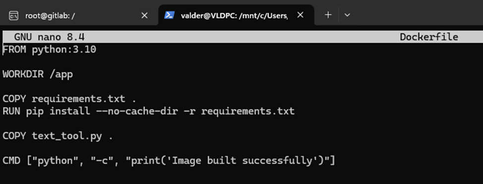

### Рис9. Содержимое файла .gitlab-ci.yml

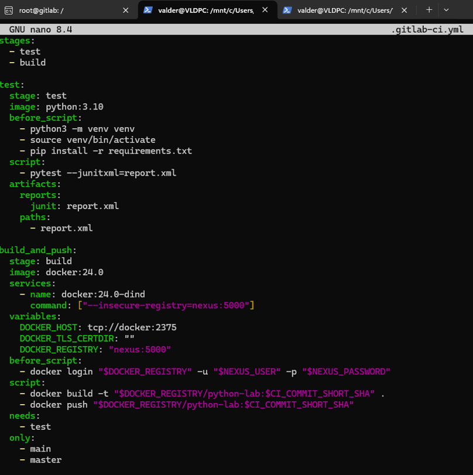

### 3.3 Подключение GitLab Runner

Для выполнения CI/CD задач был подключен GitLab Runner из окружения Linux WSL. В конфигурационном файле `config.toml` определены параметры runner'а с использованием Docker для выполнения задач.

Успешно добавлены два раннера:

- **Local Shell Runner** – использовался для начальных попыток
- **Local Docker Runner** – специально настроенный runner для выполнения Docker-зависимых задач, используется в текущей конфигурации

### Рис10. Добавлен GitLab Runner

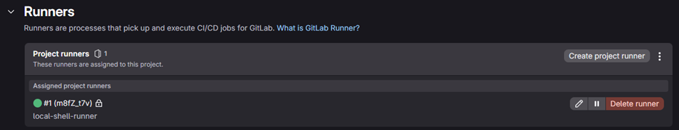

Стоит отметить, что на представленном скриншоте отображён первый добавленный раннер - `local-shell-runner`, в будущем заменённый на `local-docker-runner`, так как раннер, основанный на `shell` показал свою неэффективность при тестировании пайплайнов.

### Рис11. Cодержимое файла config.toml

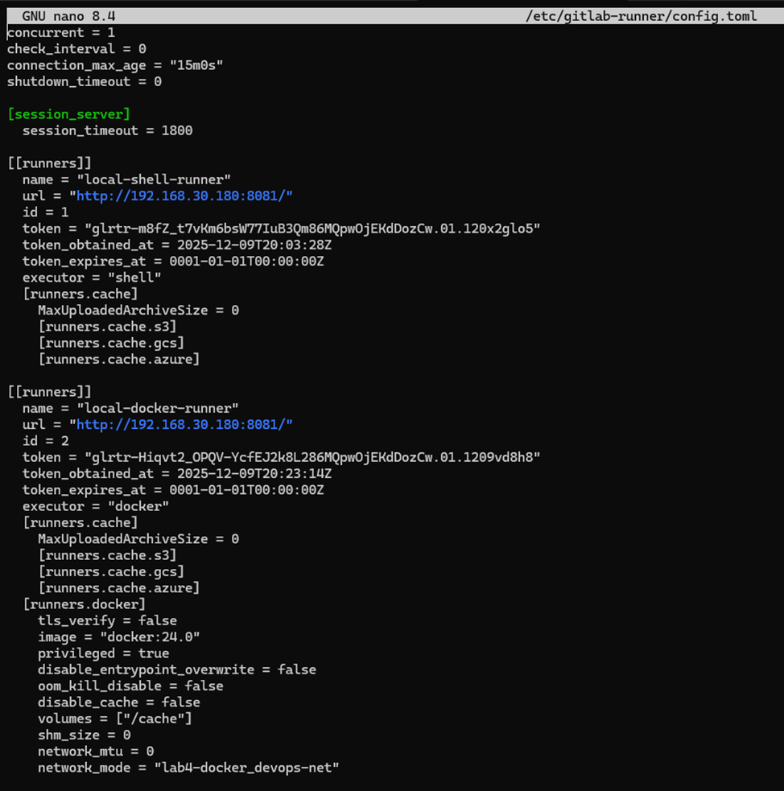

### 3.4 Настройка Nexus и Docker Registry

В Nexus был создан Docker (hosted) репозиторий, слушающий на порту `:5000`.

Для успешного взаимодействия с Nexus в Docker Desktop был добавлен параметр `insecure-registries` в файл конфигурации Docker:

```json
{
  "builder": {
    "gc": {
      "defaultKeepStorage": "20GB",
      "enabled": true
    }
  },
  "experimental": false,
  "insecure-registries": ["nexus.local:5000"]
}
```

### Рис12. Конфигурация Docker Desktop (аналог настройки локального Docker Registry)

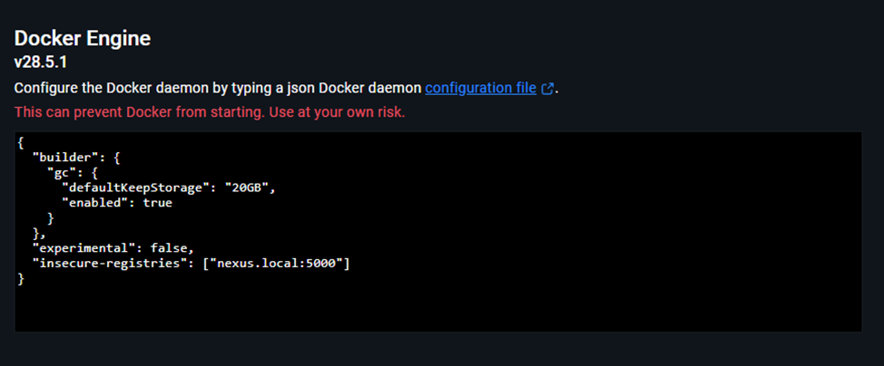

### 3.5 CI/CD переменные

В настройках проекта GitLab были созданы CI/CD переменные для аутентификации в Nexus:

- `NEXUS_USER` – логин пользователя в Nexus
- `NEXUS_PASSWORD` – пароль для аутентификации

### Ожидаемый результат

При каждом push'е в ветку `main` или `master`:

1. **Этап test**: Запускаются модульные тесты с помощью pytest
2. **Этап build**: При успешном прохождении тестов выполняется сборка Docker-образа и публикация в Docker-репозиторий Nexus

Docker-образ публикуется по адресу:

```
nexus.local:5000/python-lab:<короткий SHA коммита>
```

### Рис13. Успешно пройденный пайплайн в GitLab-коммите

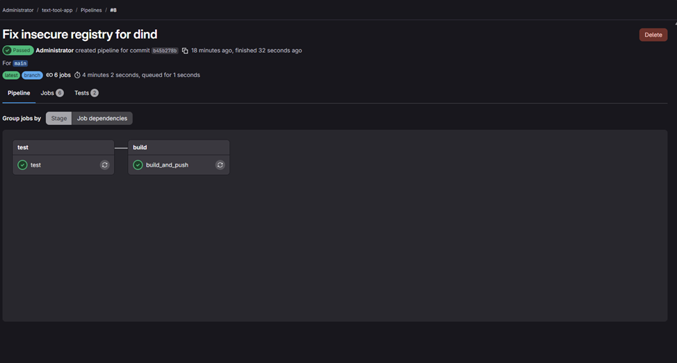

### Рис14. Интерфейс Nexus с загруженным Docker-образом

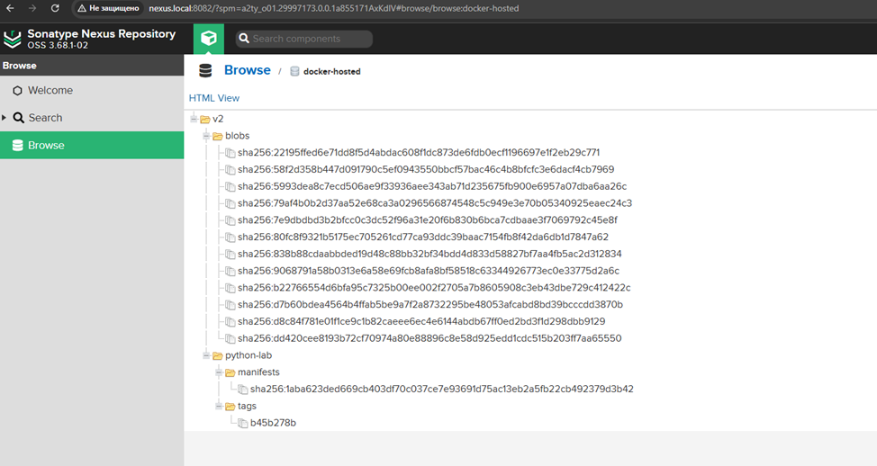

### Рис15. Docker Desktop с отслеживанием локальных образов

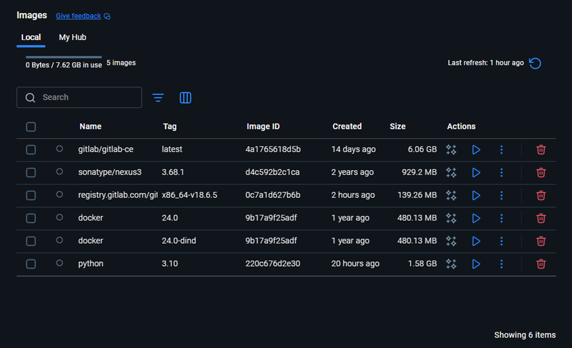

### Рис16. Коммит в GitLab c конечным (полным) содержанием репозитория

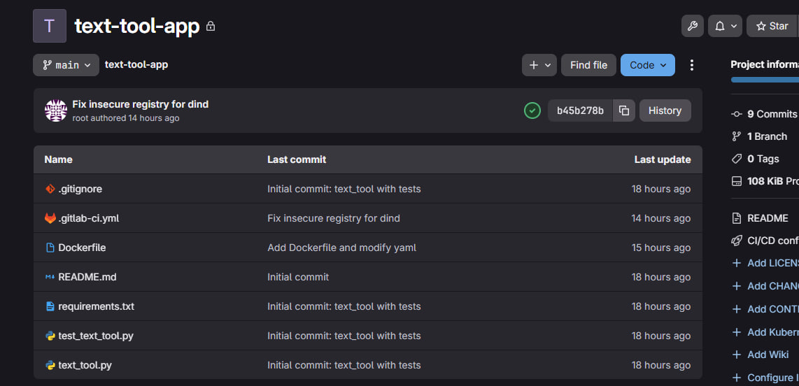

---

## Результаты выполнения работы

### 1. Развёртывание сервисов

- **GitLab** успешно запущен и доступен через веб-интерфейс на `http://192.168.30.180:8081/`
- **Nexus Repository Manager** инициализирован и готов к хранению артефактов на `http://192.168.30.180:8082/`

### 2. Выполнение тестов

Модульные тесты Python-приложения `text_tool.py` выполняются корректно:

- Функция `count_words()` правильно подсчитывает количество слов
- Функция `longest_word()` корректно находит самое длинное слово
- Все тесты проходят с ожидаемо положительным результатом

### 3. Интеграция GitLab CI/CD

- Pipeline содержит два успешно выполняемых этапа: `test` и `build_and_push`
- Тесты запускаются автоматически при каждом пуше в репозиторий
- Docker-образ собирается и публикуется в Nexus только при успешном прохождении тестов
- GitLab Runner успешно выполняет все CI/CD задачи

### 4. Проверка артефактов в Nexus

Docker-образ `python-lab` успешно опубликован в Nexus Repository Manager и доступен в Docker-репозитории с соответствующим SHA тегом коммита.

### 5. Полная автоматизация

Весь процесс автоматизирован: от момента пуша кода в Git до публикации готового Docker-образа в репозиторий. Разработчику достаточно отправить изменения в репозиторий – остальное произойдёт автоматически через GitLab CI/CD pipeline.

---

## Заключение

Лабораторная работа успешно завершена. Реализована полная автоматизация DevOps-цикла для Python-приложения с использованием современных инструментов:

- **Docker Compose** – управление многоконтейнерной инфраструктурой
- **GitLab** – система управления версиями и CI/CD платформа
- **Nexus Repository Manager** – хранилище Docker-образов
- **GitLab CI/CD** – автоматизация тестирования и сборки

Интеграция всех компонентов обеспечивает надёжный процесс разработки с автоматической проверкой качества кода и быстрой доставкой артефактов в production. Pipeline успешно выполняет все этапы обработки кода: тестирование, сборка и публикацию Docker-образов.
