# **Введение** #

Данная лабораторная работа направлена на освоение ключевых аспектов
работы с Docker, а именно: создание кастомных образов, управление
контейнерами, работа с томами и оркестрация приложений с использованием
Docker Compose и Portainer.

## **Подготовка системы и установка Docker** ##

Перед началом работы с Docker необходимо подготовить операционную
систему и установить все необходимые компоненты. Первым делом выполняем
обновление списка пакетов с помощью команды:
```
sudo apt update.
```
Эта команда обращается к репозиториям и загружает информацию о последних
версиях пакетов, что гарантирует установку актуального программного
обеспечения.

Далее устанавливаем пакеты, необходимые для работы с репозиториями по
протоколу HTTPS:
```
sudo apt install -y apt-transport-https ca-certificates
curl gnupg lsb-release
```

<p align="center">
  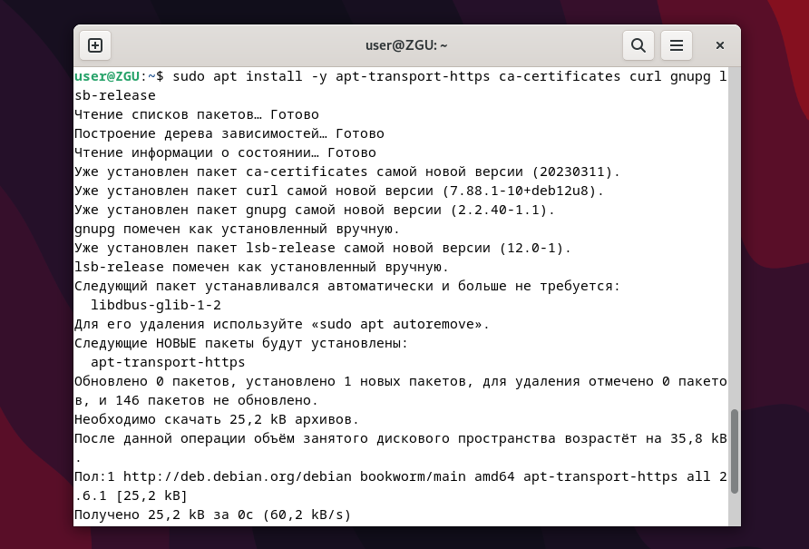
</p>

Флаг -y автоматически подтверждает установку, избегая дополнительных
запросов. Для обеспечения безопасности и проверки подлинности пакетов
Docker требуется добавить официальный GPG-ключ. Это выполняется командой
```
curl -fsSL https://download.docker.com/linux/debian/gpg | sudo gpg
--dearmor -o /usr/share/keyrings/docker-archive-keyring.gpg.
```

<p align="center">
  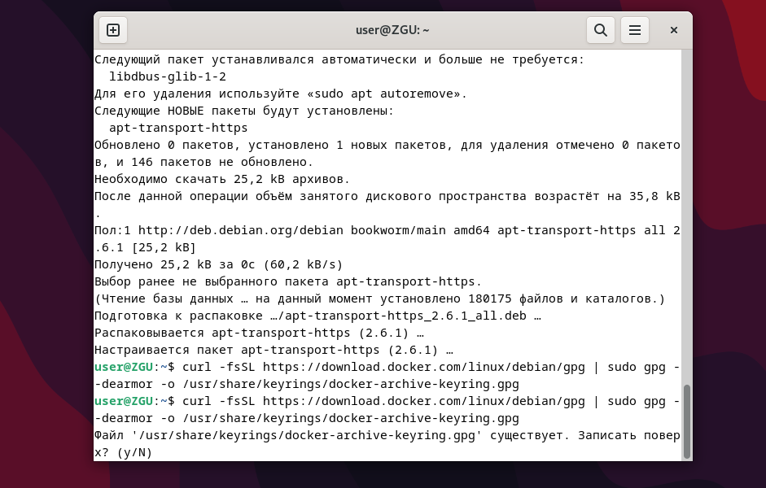
</p>

Команда curl загружает ключ, а gpg --dearmor преобразует его в формат,
понятный системе. Следующим шагом добавляем официальный репозиторий
Docker в систему с помощью команды
```
echo "deb [arch=amd64
signed-by=/usr/share/keyrings/docker-archive-keyring.gpg]
https://download.docker.com/linux/debian $(lsb_release -cs) stable" |
sudo tee /etc/apt/sources.list.d/docker.list > /dev/null
```

Здесь lsb_release -cs автоматически определяет кодовое имя дистрибутива
Debian. После добавления репозитория снова обновляется список пакетов
командой sudo apt update, и затем устанавливается Docker вместе с
дополнительными компонентами:
```
sudo apt install -y docker-ce
docker-ce-cli containerd.io docker-compose-plugin
```

<p align="center">
  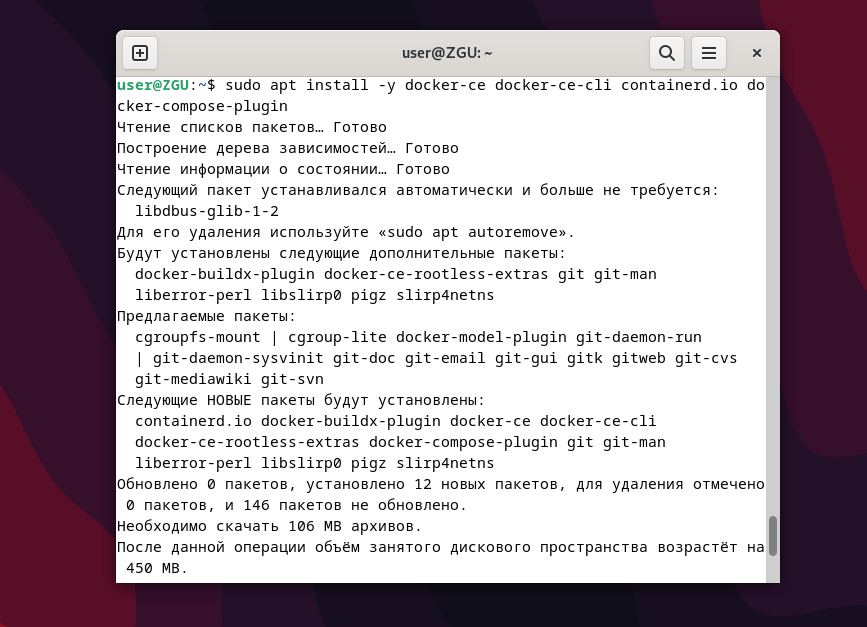
</p>

Пакет docker-ce представляет собой Community Edition Docker,
containerd.io --- среду выполнения контейнеров, а docker-compose-plugin
плагин для работы с Docker Compose. Для удобства работы с Docker без
постоянного использования sudo текущий пользователь добавляется в группу
docker:
```
sudo usermod -aG docker user
```

<p align="center">
  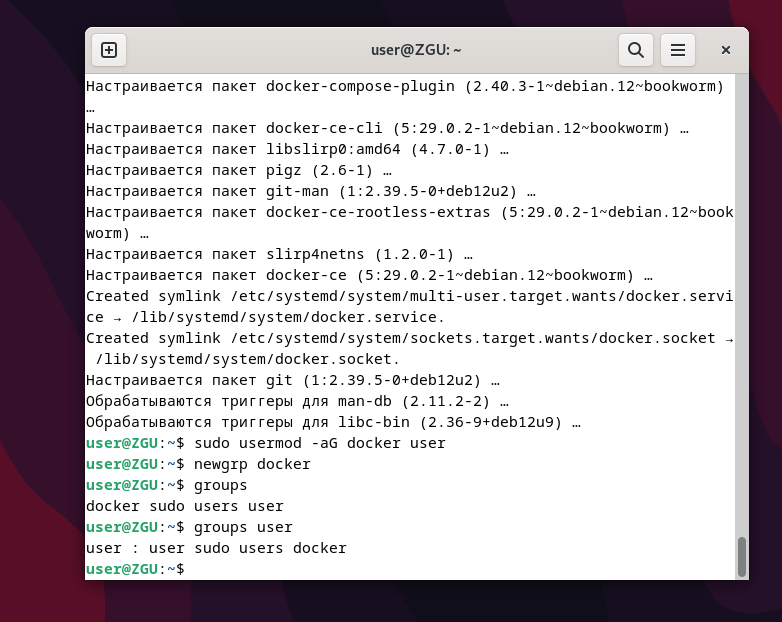
</p>

Команда newgrp docker применяет изменения без перезагрузки системы.
После этого убедимся в том, что user состоит в нужной нам группе
командой groups.

Теперь активируем и запускаем демон Docker командой
```
sudo systemctl enable docker
```
Тем самым включаем автозагрузку при старте системы.
Команда
```
sudo systemctl start docker ---
```
немедленно запускает службу.
Проверить статус демона можно командой sudo systemctl status docker,
которая показывает подробную информацию о работе службы.

<p align="center">
  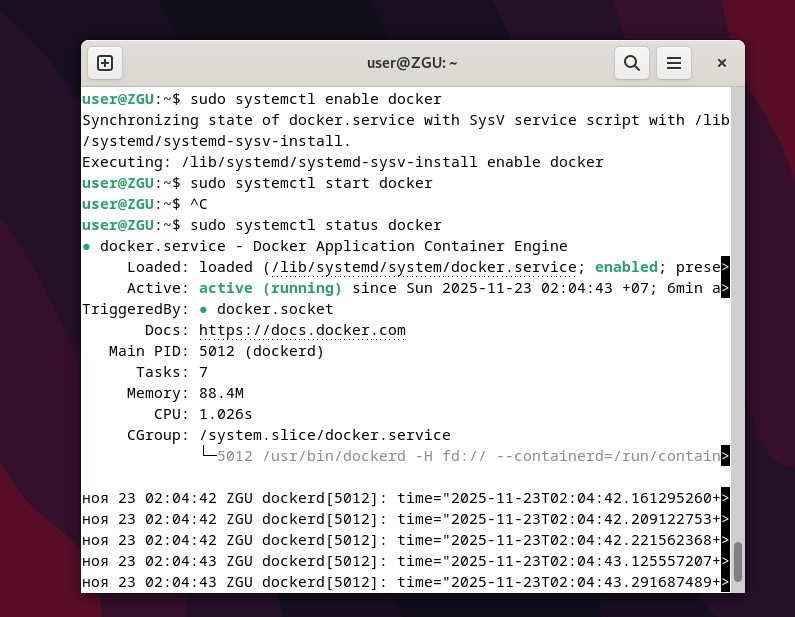
</p>

# **Задача 1** #

Docker-образ --- это шаблон, содержащий файловую систему и параметры для
запуска контейнера. Dockerfile --- это текстовый файл с инструкциями по
сборке образа. В этой задаче я создал кастомный образ на основе
nginx:1.21.1, заменив стандартную страницу приветствия на
пользовательскую.

Приступим непосредственно к выполнению. Сначала создадим рабочую
директорию для проекта. Команда
```
mkdir -p ~/docker-lab3
```
создает папку
docker-lab3 в домашней директории, а флаг -p гарантирует, что все
промежуточные каталоги будут созданы при необходимости. Затем командой
```
cd ~/docker-lab3 переходим в эту папку.
```
Далее создаем файл index.html и заполняем его командой nano.

<p align="center">
  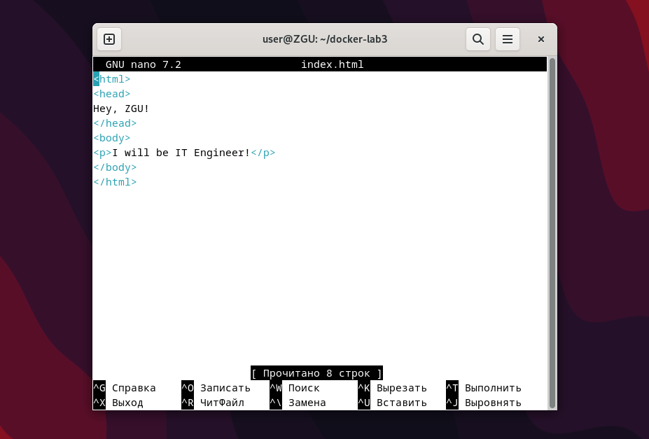
</p>

Теперь создаем Dockerfile с помощью все той же команды nano и заполняем
его. В Dockerfile указываем базовый образ nginx:1.21.1 инструкцией FROM
и копируем нашу страницу в контейнер с помощью COPY.

<p align="center">
  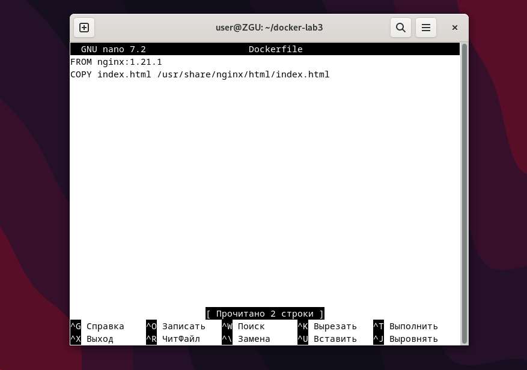
</p>

Сборка образа выполняется командой
```
docker build -t custom-nginx:1.0.0 .
```

<p align="center">
  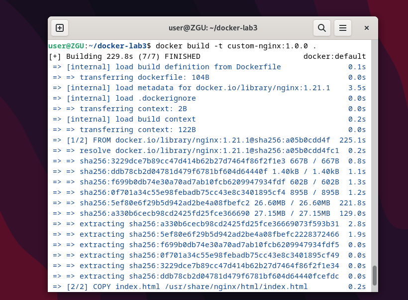
</p>

Здесь флаг -t задает имя и тег образа, а точка в конце указывает на
текущую директорию как контекст сборки.

Теперь регистрируемся на Docker Hub. По окончании регистрации наблюдаем
свою страницу.

<p align="center">
  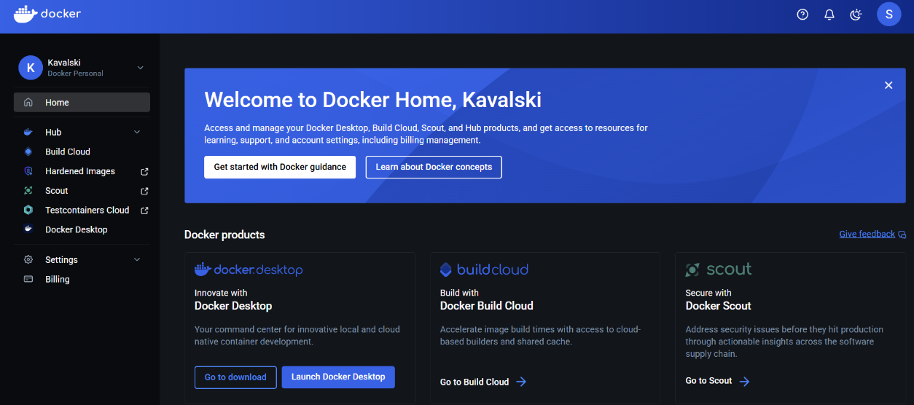
</p>

Перед загрузкой образа в Docker Hub выполняем аутентификацию командой
docker login.

<p align="center">
  
</p>

Затем помечаем образ для репозитория с помощью
```
docker tag
custom-nginx:1.0.0 slavyanin2005/custom-nginx:1.0.0
```
, где slavyanin2005
--- наше имя пользователя на Docker Hub. Загружаем образ командой
```
docker
push slavyanin2005/custom-nginx:1.0.0.
```

<p align="center">
  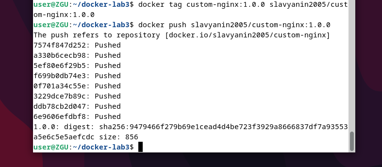
</p>

В итоге наш образ успешно собран и размещен в Docker Hub по ссылке:
https://hub.docker.com/r/slavyanin2005/custom-nginx.

<p align="center">
  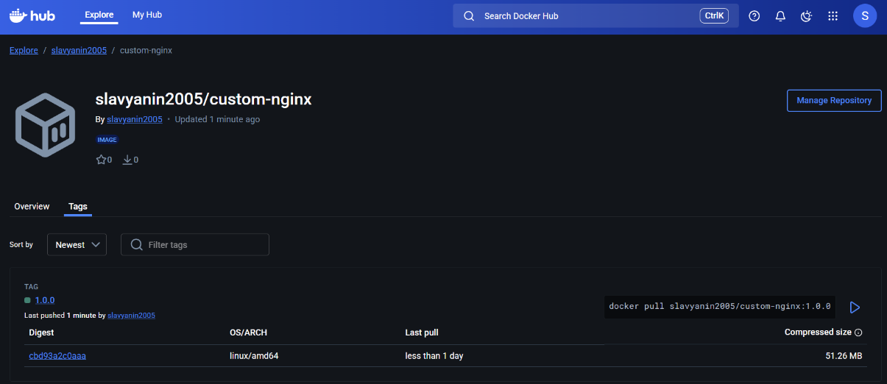
</p>

# **Задача 2** #

После создания образа переходим к работе с контейнерами. Запускаем
контейнер командой
```
docker run -d --name ostafinskij-custom-nginx-t2 -p
127.0.0.1:8080:80 custom-nginx:1.0.0.
```

<p align="center">
  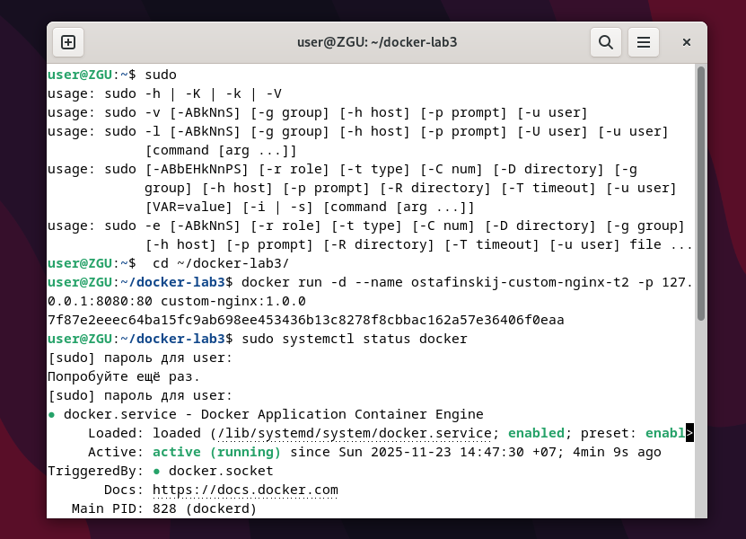
</p>

Флаг -d запускает контейнер в фоновом режиме, --name задает уникальное
имя контейнера, а -p 127.0.0.1:8080:80 настраивает проброс портов. Порт
8080 на локальном хосте перенаправляется на порт 80 внутри контейнера.

Для удобства дальнейшей работы переименовываем контейнер командой
```
docker rename ostafinskij -custom-nginx-t2 custom-nginx-t2.
```
Теперь выполним комплексную проверку работы контейнера с помощью
последовательности команд:
```
date +"%d-%m-%Y %T.%N %Z"; sleep 0.150;
docker ps; ss -tlpn | grep 127.0.0.1:8080; docker logs custom-nginx-t2
-n1; docker exec -it custom-nginx-t2 base64
/usr/share/nginx/html/index.html
```

<p align="center">
  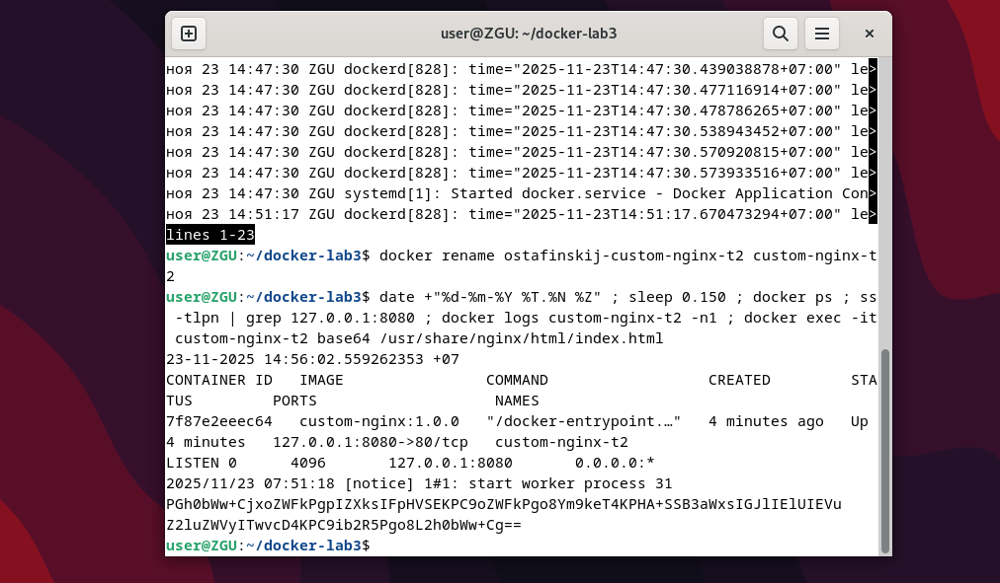
</p>

Команда date выводит текущую дату и время с наносекундами и часовым
поясом. sleep 0.150 приостанавливает выполнение на 150 миллисекунд.
docker ps показывает список активных контейнеров. Команда
```
ss -tlpn | grep 127.0.0.1:8080
```
проверяет, слушает ли система на порту 8080. docker logs
custom-nginx-t2 -n1 выводит последнюю строку логов контейнера.
```
docker exec -it custom-nginx-t2 base64 /usr/share/nginx/html/index.html
```
кодирует содержимое HTML-файла в base64 для проверки целостности данных.

Далее проверяем доступность веб-страницы через curl
http://127.0.0.1:8080, что должно вернуть HTML-код созданной страницы.

<p align="center">
  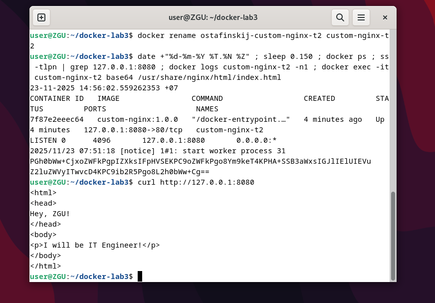
</p>

В итоге контейнер успешно запущен, а веб-страница доступна по адресу
http://127.0.0.1:8080.

# **Задача 3** #

Углубляемся в управление контейнерами и их конфигурацией. Подключаемся к
работающему контейнеру с помощью
```
docker attach custom-nginx-t2.
```

<p align="center">
  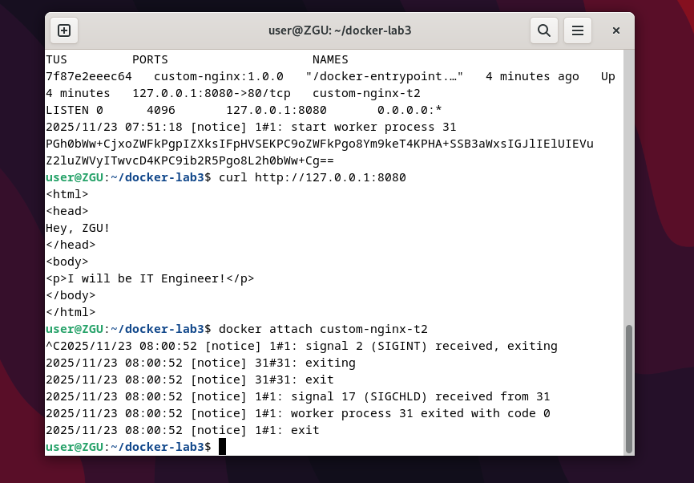
</p>

Эта команда подключает терминал к основному процессу контейнера (nginx).
Нажатие Ctrl+C отправляет сигнал SIGINT процессу nginx, что приводит к
его корректному завершению.

Проверяем статус контейнера командой
```
docker ps -a
```
Флаг -a показывает
все контейнеры, включая остановленные, где мы видим статус "Exited".

<p align="center">
  
</p>

Перезапускаем контейнер командой
```
docker start custom-nginx-t2.
```
Для изменения конфигурации nginx подключаемся к контейнеру в
интерактивном режиме с помощью
```
docker exec -it custom-nginx-t2 bash
```
Флаг -it обеспечивает интерактивный режим с pseudo-TTY.

Начинаем ключевой этап изменения конфигурации nginx. Первым делом
необходимо проверить текущую конфигурацию портов. Выполняем команду
```
cat /etc/nginx/conf.d/default.conf | grep listen
```
, которая показывает, что
nginx в текущем контейнере настроен на прослушивание порта 80, как и в
исходном образе.

<p align="center">
  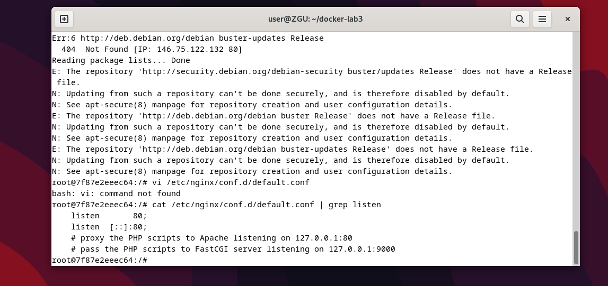
</p>

Мы видим строки "listen 80;" и "listen [::]:80;", что подтверждает
необходимость изменений. Теперь приступаем к редактированию
конфигурационного файла. Используем команду
```
sed -i 's/listen 80;/listen 81;/' /etc/nginx/conf.d/default.conf
```
, которая выполняет прямую замену в
файле, меняя порт 80 на 81 в первой строке конфигурации. Затем выполняем
вторую замену:
```
sed -i 's/listen :::::80;/listen :::::81;/' /etc/nginx/conf.d/default.conf
```
для изменения IPv6-порта. Команда
```
sed -i
```
редактирует файл напрямую без создания временных копий, что особенно
важно в окружении контейнера с ограниченными ресурсами.

<p align="center">
  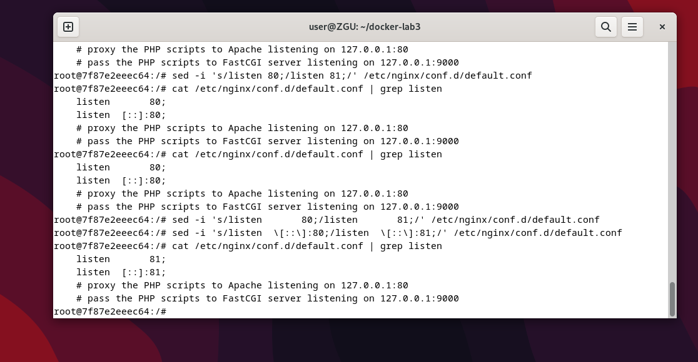
</p>

После внесения изменений обязательно проверяем результат. Снова
выполняем
```
cat /etc/nginx/conf.d/default.conf | grep listen
```
и видим, что
порты успешно изменены на 81. Теперь nginx настроен на прослушивание
порта 81 вместо стандартного порта 80. Применяем изменения перезагрузкой
nginx:
```
nginx -s reload
```
Эта команда отправляет сигнал reload основному
процессу nginx, что заставляет его перечитать конфигурационные файлы без
полной остановки службы. Проверяем работу на новых портах командой
```
curl http://127.0.0.1:81
```
, которая должна вернуть HTML-страницу с сообщением
"Hey, ZGU!", что подтверждит успешную работу nginx на новом порту.
Одновременно проверяем, что старый порт больше не работает с помощью
```
curl http://127.0.0.1:80
```
Команда возвращает ошибку "Connection refused", что
ожидаемо и подтверждает правильность наших изменений.

<p align="center">
  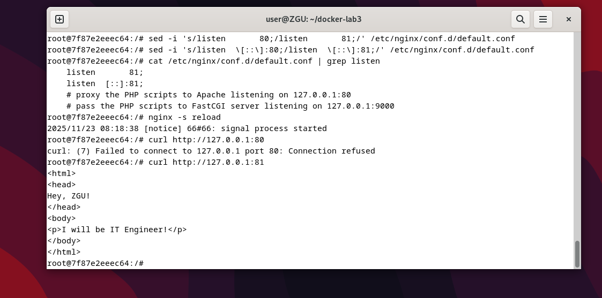
</p>

Выходим из контейнера:
```
exit
```
, возвращаясь в среду хостовой системы.
Теперь проверяем доступность с хоста:
```
curl http://127.0.0.1:8080
```
Здесь
возникает проблема: хотя мы изменили порт nginx внутри контейнера на 81,
проброс портов в Docker остался настроенным на порт 80. Команда
```
docker port custom-nginx-t2
```
показывает "80/tcp -> 127.0.0.1:8080", что
подтверждает несоответствие конфигураций. В результате curl возвращает
"Empty reply from server", поскольку запрос перенаправляется на
несуществующий порт 80 внутри контейнера.

<p align="center">
  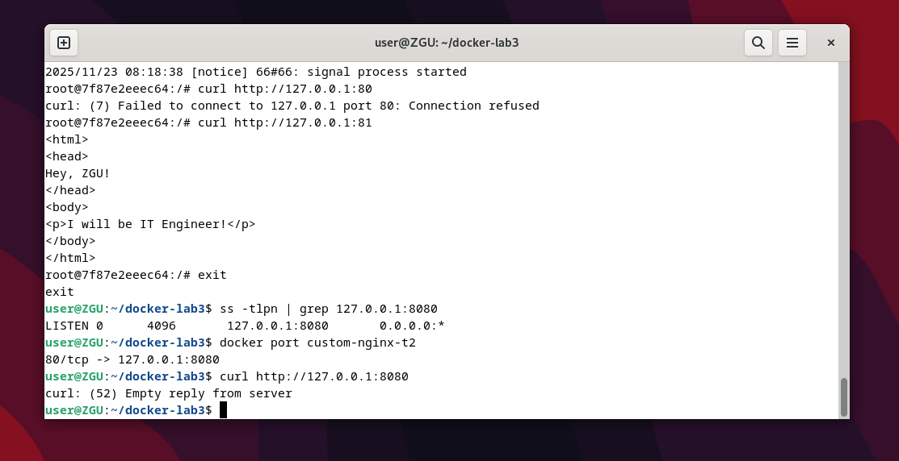
</p>

Для решения этой проблемы останавливаем текущий контейнер:
```
docker stop custom-nginx-t2
```
, а затем создаем новый контейнер с правильным пробросом
портов:
```
docker run -d --name custom-nginx-t2-fixed -p 127.0.0.1:8080:81 custom-nginx:1.0.0.
```

<p align="center">
  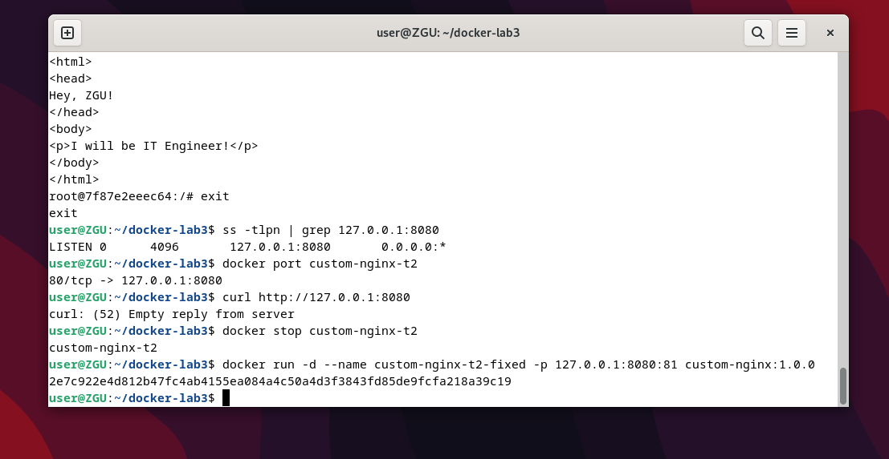
</p>

Однако здесь возникает новая сложность. Новый контейнер создается из
исходного образа custom-nginx:1.0.0, в котором nginx все еще настроен на
порт 80, поэтому нам приходится повторять процесс изменения конфигурации
внутри нового контейнера. Подключаемся к custom-nginx-t2-fixed через
```
docker exec -it custom-nginx-t2-fixed bash
```
и снова выполняем всю
последовательность изменений: проверяем текущие порты через
```
cat /etc/nginx/conf.d/default.conf | grep listen
```
, изменяем порты с помощью
sed, проверяем изменения, перезагружаем nginx и тестируем оба порта
через curl.

<p align="center">
  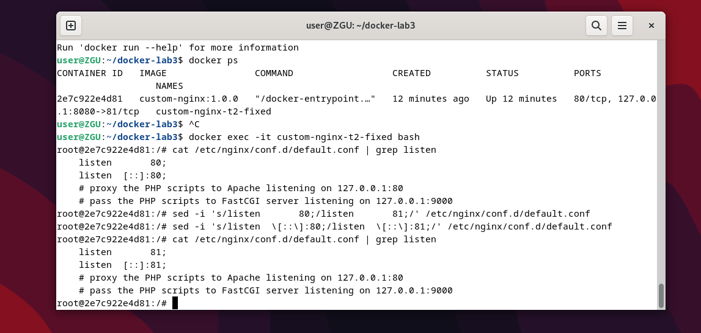
</p>

<p align="center">
  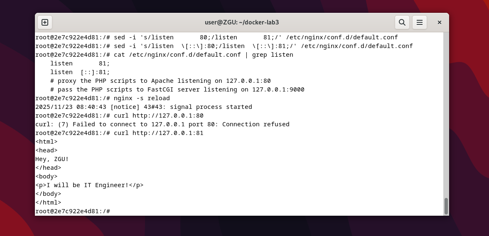
</p>

Только после этого выходим из контейнера и выполняем финальную проверку
с хоста командой
```
curl http://127.0.0.1:8080.
```

<p align="center">
  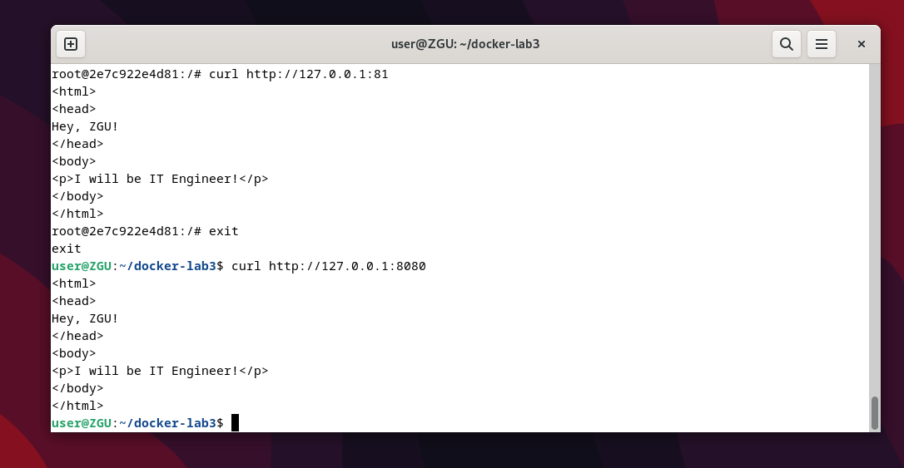
</p>

Теперь мы видим, что команда успешно возвращает нашу HTML-страницу, а
это подтверждает полную работоспособность системы. Таким образом
контейнер модифицирован, проблема с несоответствием портов решена,
продемонстрированы методы изменения конфигурации работающих контейнеров
и важность согласованности настроек Docker и внутренних сервисов. Весь
процесс потребовал многократного изменения конфигурации и тщательной
проверки на каждом этапе.

# **Задача 4** #

Изучим работу с томами Docker для организации общего доступа к данным
между контейнерами и хост-системой. Запускаем контейнер CentOS:
```
docker run -d --name centos-container -v $(pwd):/data centos:7 tail -f /dev/null.
```

<p align="center">
  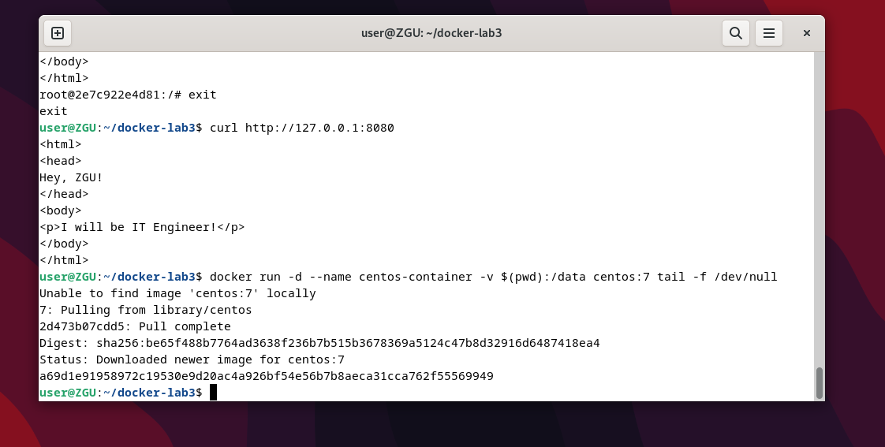
</p>

Флаг -v $(pwd):/data монтирует текущую директорию хоста в папку /data
контейнера. Команда
```
tail -f /dev/null
```
поддерживает работу контейнера в
фоновом режиме. Аналогично запускаем контейнер Debian:
```
docker run -d --name debian-container -v $(pwd):/data debian:11 tail -f /dev/null.
```

<p align="center">
  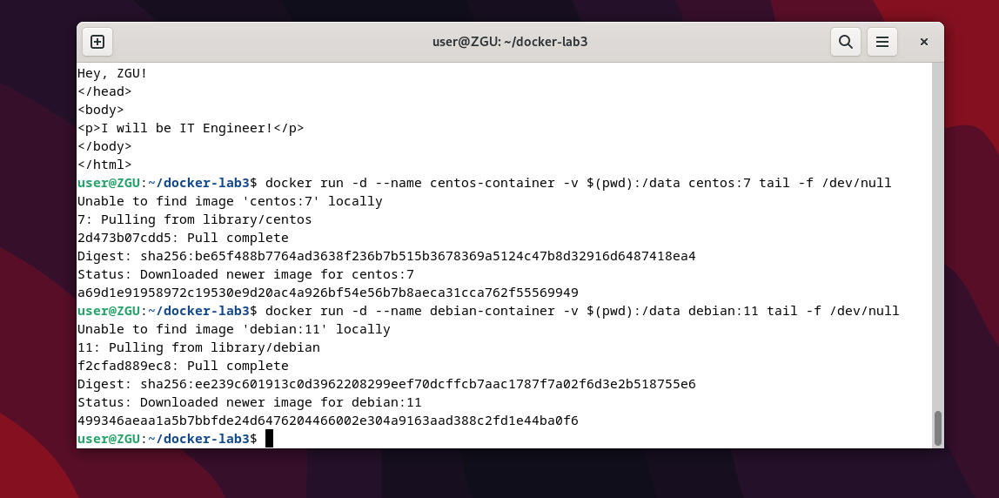
</p>

Создаем файл из контейнера CentOS:
```
docker exec centos-container bash -c "echo 'File from CentOS' > /data/centos-file.txt"
```
и для уверенности
проверяем его наличие.

<p align="center">
  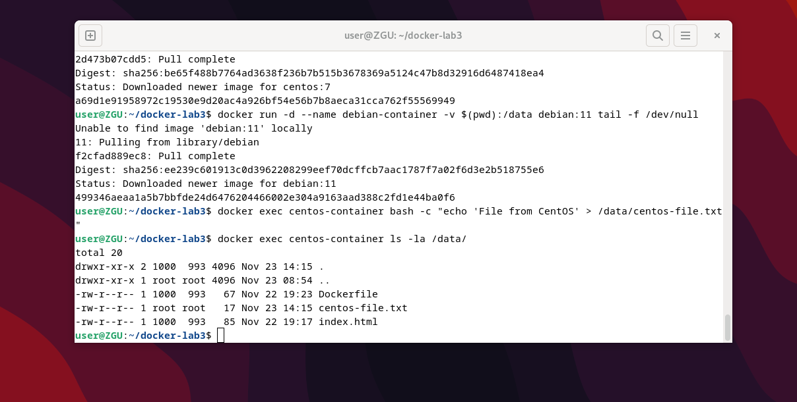
</p>

Так же проверяем на хосте.

<p align="center">
  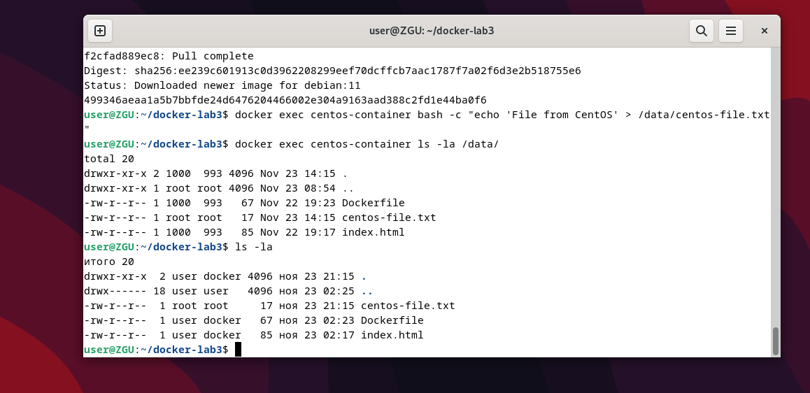
</p>

Создаем так же файл на хосте с помощью
```
echo "File from host" > host-file.txt.
```

Проверяем синхронизацию в контейнере Debian:
```
docker exec debian-container ls -la /data/
```
выводит список файлов в смонтированной директории.

<p align="center">
  
</p>

Команда
```
docker exec debian-container cat /data/centos-file.txt
```
отображает содержимое файла, созданного в CentOS, а
```
docker exec debian-container cat /data/host-file.txt
```
показывает содержимое файла,
созданного на хосте.

<p align="center">
  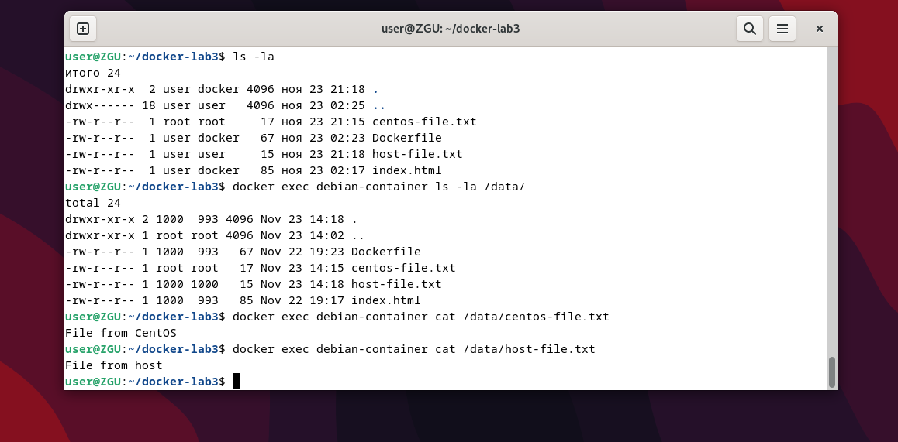
</p>

Таким образом мы продемонстрировали эффективную работу с томами Docker
--- файлы успешно синхронизируются между хост-системой и различными
контейнерами.

# **Задача 5** #

Переходим к оркестрации контейнеров с помощью Docker Compose и
визуальному управлению через Portainer.

Создаем отдельную директорию для задачи и переходим в неё с помощью все
тех же команд
```
mkdir -p /tmp/ZGU/docker/task
```
и
```
cd /tmp/ZGU/docker/task.
```

<p align="center">
  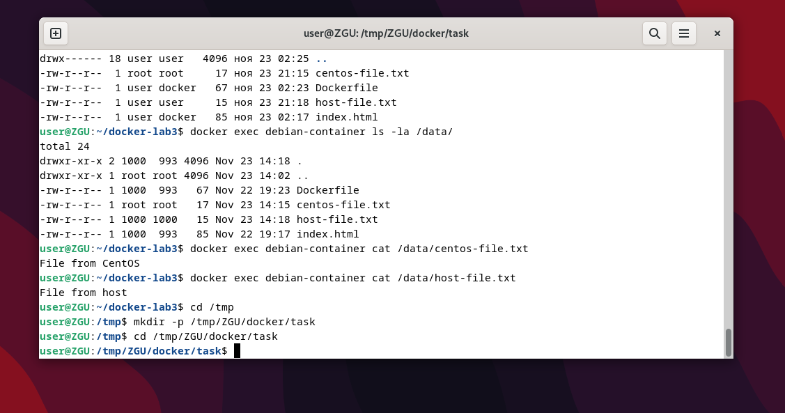
</p>

Создаем файл compose.yaml с определением сервиса Portainer, который
использует network_mode: host нужен для доступа к сетевым интерфейсам
хоста и монтирования Docker socket для управления.

<p align="center">
  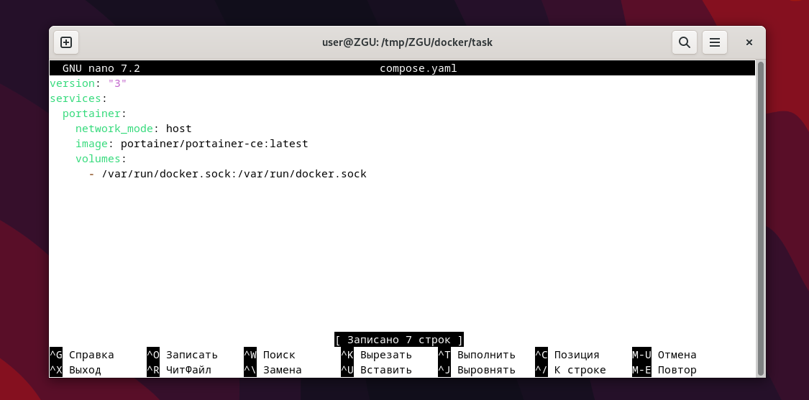
</p>

Теперь создаем файл docker-compose.yaml с сервисом registry, который
предоставляет локальный реестр Docker образов на порту 5000.

<p align="center">
  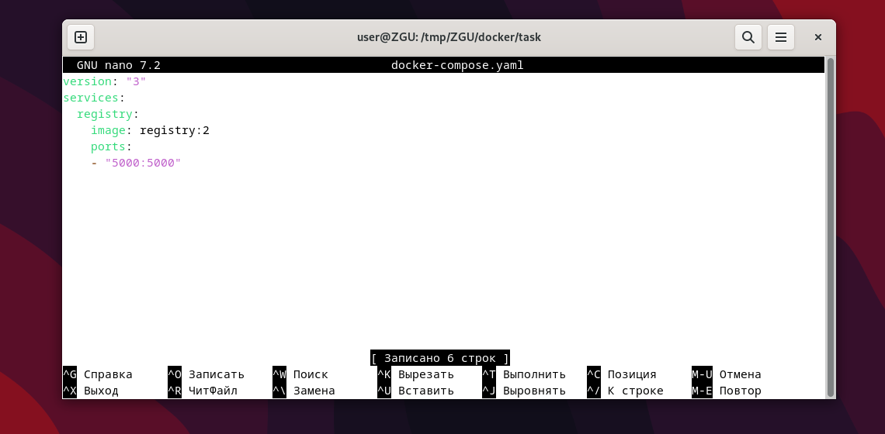
</p>

Запускаем компоуз командой
```
docker compose up --d.
```

<p align="center">
  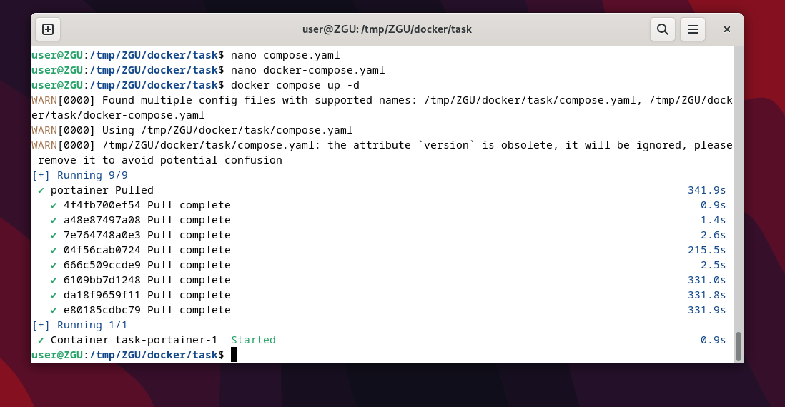
</p>

Docker Compose автоматически выбирает файл compose.yaml как имеющий
высший приоритет согласно документации. Теперь объединяем оба сервиса в
один файл compose.yaml, добавляя сервис registry к существующей
конфигурации.

<p align="center">
  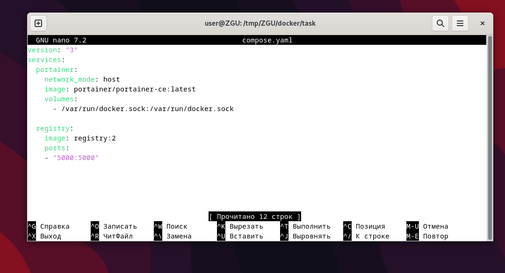
</p>

Перезапускаем компоуз командой
```
docker compose down
```
, что останавливает и
удаляет контейнеры,
```
docker compose up --d
```
в свою очередь запускает
обновленную конфигурации.

<p align="center">
  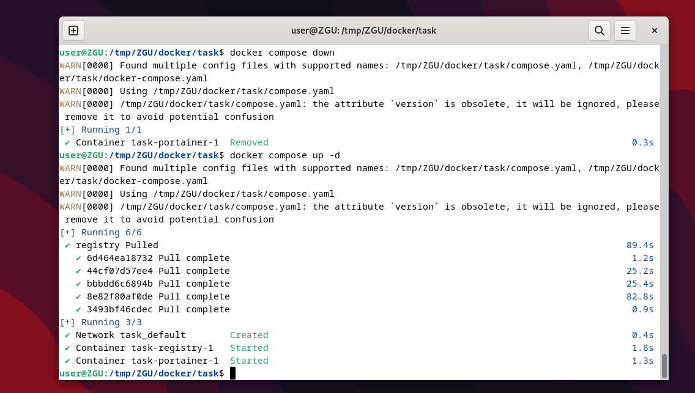
</p>

Загружаем кастомный образ в локальный registry с помощью команды
```
docker tag custom-nginx:1.0.0 127.0.0.1:5000/custom-nginx:latest
```
которая
помечает образ для загрузки в локальный реестр,
```
docker push 127.0.0.1:5000/custom-nginx:latest
```
непостредственно загружает образ в
registry.

<p align="center">
  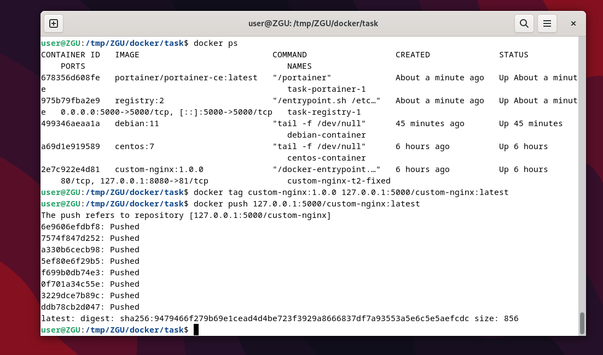
</p>

Теперь настраиваем Portainer через веб-интерфейс по адресу
http://127.0.0.1:9000. Тут пришлось перезагпузить портейнер, так как
изначально страница по адресу не открывалась.

<p align="center">
  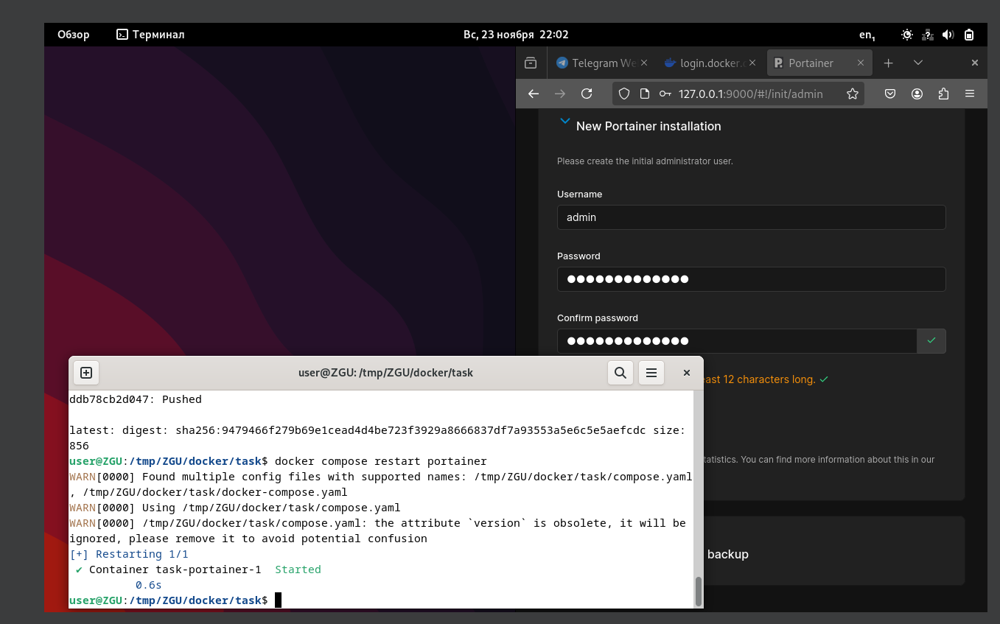
</p>

Создаем администраторскую учетную запись и подключаем локальное
Docker-окружение.

<p align="center">
  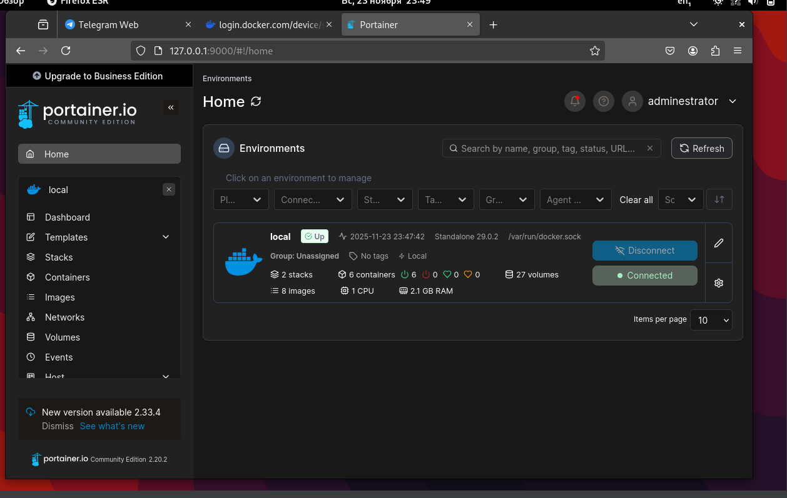
</p>

Тут возникла проблема: при попытке перейти в наш environment происходило
переключение из up в down, любые попытки перезапустить и переподключить
environment не заканчивались успехом. Решением проблемы стало изменение
версии портейнера в файле compose с latest на более старую и стабильную.

Деплоим стек через Portainer, используя веб-редактор для ввода
YAML-конфигурации.

<p align="center">
  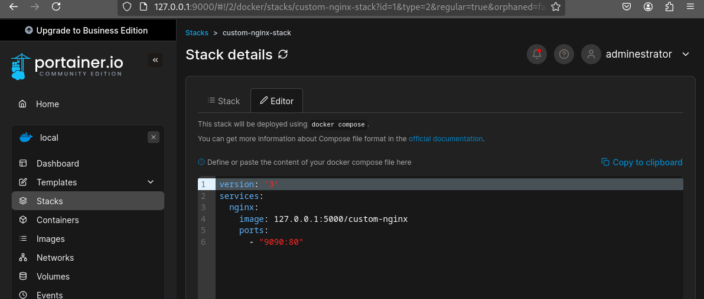
</p>

Мы внесли в стек простую конфигурацию для запуска nginx из нашего
кастомного образа. В файле стека мы указали что нужно запустить сервис
nginx используя образ 127.0.0.1:5000/custom-nginx из нашего локального
registry и пробросить порт 9090 хоста на порт 80 контейнера. Это нужно
было чтобы продемонстрировать работу: наш кастомный образ хранится в
локальном registry, откуда его забирает Docker Compose и разворачивает
как сервис в стеке, делая доступным по адресу http://127.0.0.1:9090.
Таким образом мы замкнули полный цикл работы с Docker.

Теперь проверяем доступность nginx после деплоя стека. Выполняем команду
curl http://127.0.0.1:9090, которая отправляет HTTP-запрос к нашему
веб-серверу. В ответ получаем HTML-код нашей кастомной страницы с
текстом
```
"Hey, ZGU! I will be IT Engineer!".
```
Это подтверждает, что стек
успешно развернут и nginx работает корректно, обслуживая созданную нами
страницу через порт 9090 на локальном хосте.

<p align="center">
  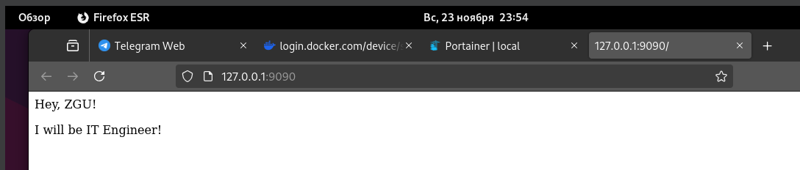
</p>

Переходим к анализу контейнера через Portainer. В веб-интерфейсе
Portainer открываем раздел "Containers", где находим контейнер с
именем нашего стека. Кликаем на его имя для перехода к детальной
информации, затем нажимаем кнопку "Inspect", которая открывает полную
техническую информацию о контейнере.

<p align="center">
  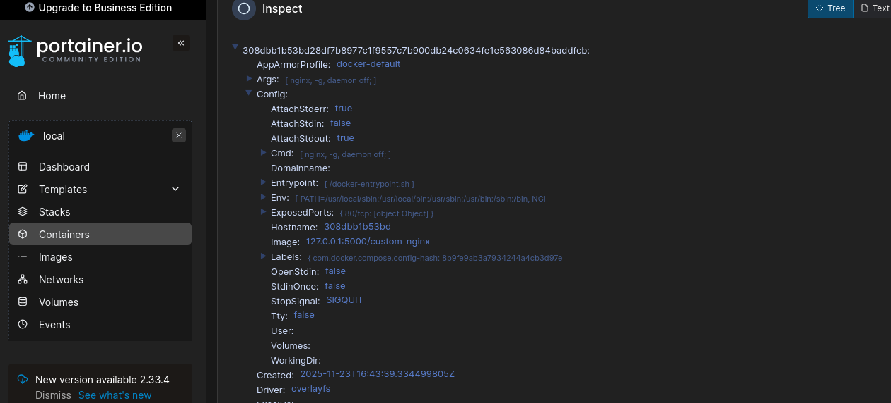
</p>

Особое внимание уделяем разделу "Config", изучая поля от
AppArmorProfile до Driver. В поле AppArmorProfile видим значение
docker-default, что указывает на использование стандартного профиля
безопасности. Поле Image показывает 127.0.0.1:5000/custom-nginx,
подтверждая что контейнер использует наш кастомный образ из локального
registry. В разделе Config.Cmd видим команду запуска
```
["nginx", "-g", "daemon off;"]
```
Этот детальный анализ позволяет убедиться в
правильности конфигурации контейнера и соответствии нашим требованиям.

В конце демонстрируем работу Docker Compose с единственным оставшимся
файлом. Выполняем команду rm compose.yaml, которая удаляет основной файл
компоуза из текущей директории. Теперь в директории остается только файл
docker-compose.yaml, что имитирует ситуацию когда у нас есть только один
файл конфигурации. Запускаем компоуз в измененных условиях. Выполняем
команду
```
docker compose up -d
```
, которая пытается развернуть проект на
основе оставшегося файла docker-compose.yaml.

<p align="center">
  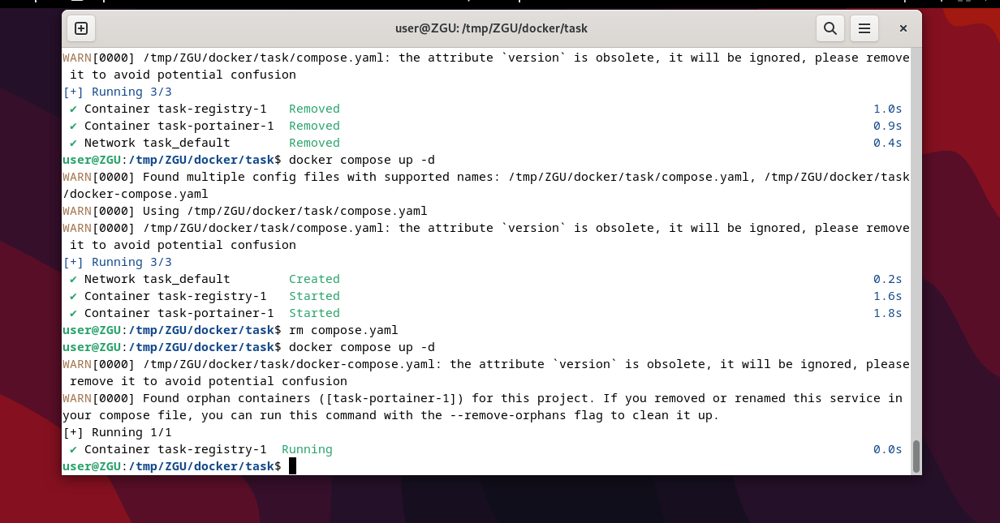
</p>

В процессе выполнения возникают два важных предупреждения. Первое
предупреждение:
```
version is obsolete
```
сообщает что атрибут version в
формате Compose устарел и игнорируется системой. Это связано с тем что
современные версии Docker Compose автоматически определяют версию
формата и явное указание версии стало избыточным. Второе предупреждение:
```
Found orphan containers
```
указывает что обнаружены контейнеры (в
частности task-portainer-1), которые не управляются текущим
компоуз-файлом. Это происходит потому что эти контейнеры были созданы
предыдущими запусками с другим составом сервисов. Система предлагает
использовать флаг
```
--remove-orphans
```
для автоматической очистки таких
контейнеров.

Завершаем работу над проектом. Выполняем команду docker compose down,
которая корректно останавливает и удаляет все контейнеры, связанные с
текущим компоуз-проектом.

<p align="center">
  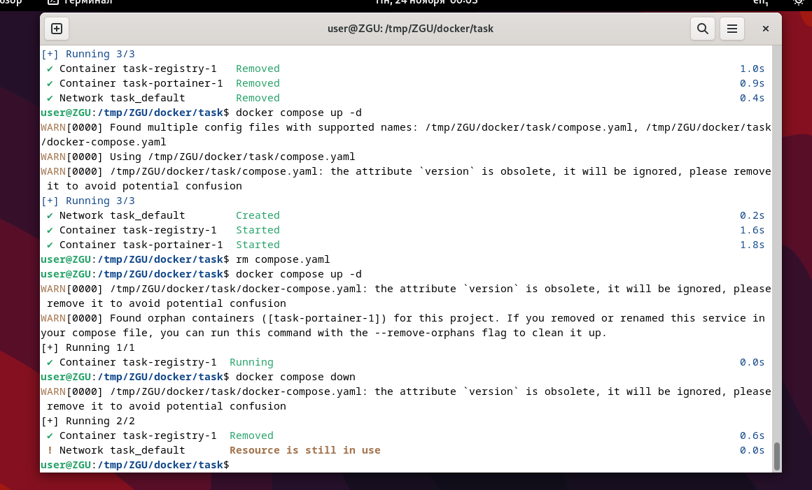
</p>

Эта команда также удаляет созданные Docker-сети, которые больше не
используются другими контейнерами. Однако если какие-то сети все еще
используются другими контейнерами, как в нашем случае, система выведет
соответствующее предупреждение
```
Network task_default Resource is still in use
```
, что является нормальным поведением и свидетельствует о защите
работающих ресурсов от случайного удаления.

Весь этот процесс наглядно демонстрирует важные аспекты работы с Docker
Compose, такие как приоритеты файлов конфигурации, управление жизненным
циклом контейнеров, обработку устаревших параметров и механизмы очистки
неиспользуемых ресурсов.

# **Заключение** #

В ходе лабораторной работы был пройден полный цикл работы с Docker ---
от первоначальной установки и настройки на операционной системе Debian
до развертывания сложных многоконтейнерных приложений. Особое внимание
уделено практическим аспектам: создание кастомных образов, управление
жизненным циклом контейнеров, работа с томами для организации общего
доступа к данным, оркестрация сервисов через Docker Compose и визуальное
управление инфраструктурой через Portainer. Все задачи выполнены
успешно, полученные навыки позволяют эффективно работать с
контейнеризацией в реальных проектах.
