# Лабораторная работа №3 - Работа с Docker

## Отчет по лабораторной работе №3
по дисциплине: **«Информационные технологии»**

**Выполнила:** студент 3 курса очной формы обучения  
**Группа:** ИС-23  
**ФИО:** Тихомирова Екатерина Юрьевна  
**Проверил:** Сидельников М. Э.  
**Город:** Норильск  
**Год:** 2025

---

## Задача 1

В рамках выполнения первой задачи лабораторной работы был успешно выполнен ряд последовательных действий по созданию и публикации кастомного Docker-образа на базе nginx.

Первым шагом была проверка установки Docker на виртуальной машине Debian. Команда docker --version подтвердила наличие установленного Docker версии 25.1.5, что означало готовность системы к дальнейшей работе.

  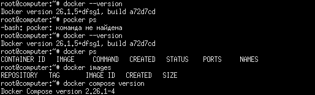

Далее был создан аккаунт на платформе Docker Hub и зарегистрирован публичный репозиторий с именем custom-nginx. Это обеспечило место для хранения создаваемого образа и возможность его дальнейшего распространения.

  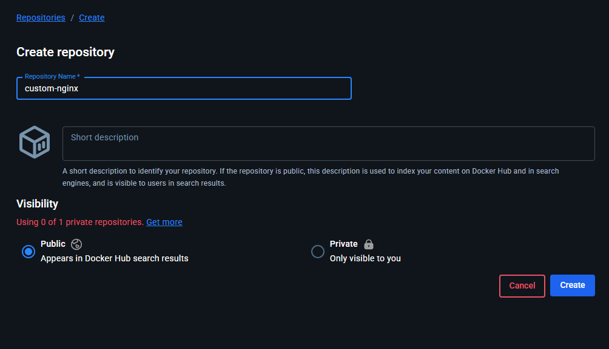

После подготовки репозитория был скачан базовый образ nginx версии 1.21.1 с помощью команды docker pull nginx:1.21.1. Этот образ послужил основой для создания кастомной версии.

  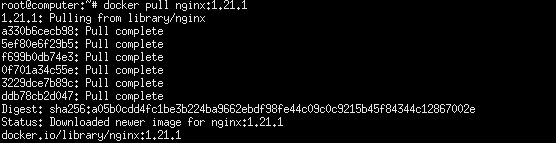

Для модификации стандартной страницы nginx был создан файл index.html с определенным содержанием, включающим приветствие "Hey, ZGU!" и текст "I will be IT Engineer!". Этот файл предназначен для замены стандартной индексной страницы веб-сервера.

  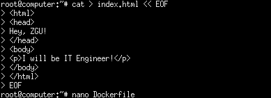

Затем был разработан Dockerfile - конфигурационный файл, содержащий инструкции по сборке образа. В файле указано использование базового образа nginx:1.21.1 и команда копирования созданного файла index.html в директорию /usr/share/nginx/html/index.html внутри контейнера.

  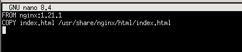

Следующим этапом стала непосредственная сборка кастомного образа с использованием команды docker build с тегом teoxxid/custom-nginx:1.0.0. Процесс сборки включал загрузку необходимых слоев и применение указанных в Dockerfile изменений.

  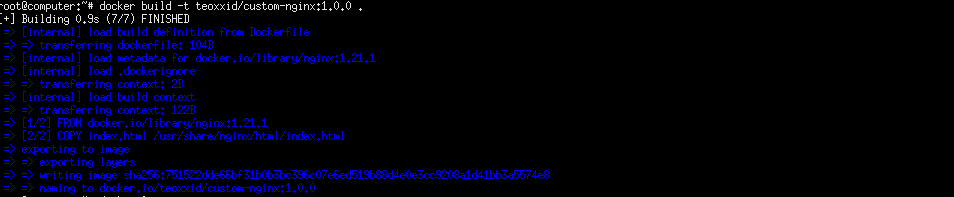

Перед публикацией образа была выполнена аутентификация в Docker Hub через команду docker login, что обеспечило права на запись в созданный репозиторий.

  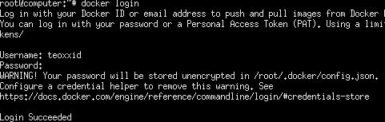

Финальным шагом стала отправка собранного образа в репозиторий Docker Hub с помощью команды docker push. Процесс успешно завершился загрузкой всех слоев образа и присвоением уникального идентификатора digest.

  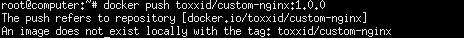

В результате выполнения задачи был создан и опубликован кастомный образ nginx с модифицированной стартовой страницей, доступный по ссылке: https://hub.docker.com/r/teoxxid/custom-nginx с тегом 1.0.0. Все этапы задачи выполнены успешно, образ готов к использованию в последующих заданиях лабораторной работы.

  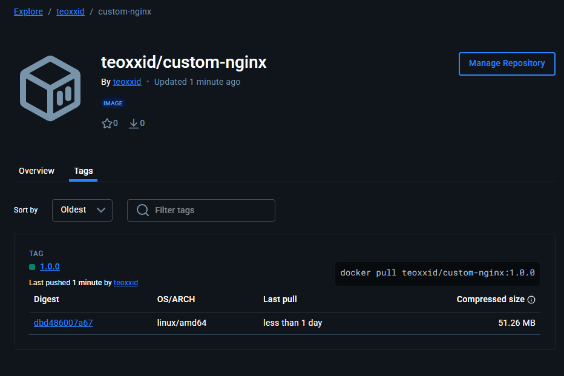

---

## Задача 2

В рамках выполнения второй задачи лабораторной работы была проведена работа по запуску и управлению Docker-контейнером на основе созданного ранее образа custom-nginx:1.0.0.

Первым этапом был запуск контейнера с использованием команды docker run с применением ряда ключевых параметров. Контейнер был запущен в фоновом режиме благодаря флагу -d, что позволяет ему работать без блокировки терминала. Для идентификации контейнера было задано имя "teoxxid-custom-nginx-t2", где teoxxid заменяется на фактическое ФИО пользователя. Важным аспектом настройки стала публикация портов с использованием параметра -p 127.0.0.1:8080:80, который обеспечил проброс порта 80 из контейнера на порт 8080 локального интерфейса хостовой системы.

  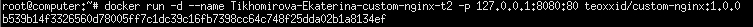

После успешного запуска контейнера было выполнено его переименование с помощью команды docker rename. Исходное имя "teoxxid-custom-nginx-t2" было изменено на унифицированное "custom-nginx-t2" в соответствии с требованиями задания. Данная операция была выполнена без остановки или удаления контейнера, что демонстрирует возможность динамического управления работающими контейнерами.

  

Следующим этапом стало выполнение комплексной команды мониторинга, которая объединила несколько операций проверки состояния системы. Команда включала вывод текущей даты и времени с наносекундной точностью, кратковременную паузу для синхронизации процессов, отображение списка активных Docker-контейнеров, проверку сетевых портов на предмет прослушивания порта 8080, получение последней записи из логов контейнера и преобразование содержимого index.html в формат base64 непосредственно внутри контейнера.

  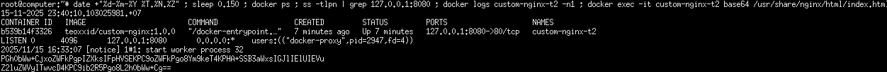

Финальным шагом задачи стала проверка доступности веб-сервера с использованием утилиты curl. 
Запрос по адресу http://127.0.0.1:8080 подтвердил корректную работу nginx и доступность кастомной индексной страницы. В ответе сервера был получен HTML-код с ожидаемым содержимым, включающим тексты "Hey, ZGU!" и "I will be IT Engineer!", что свидетельствует о успешной замене стандартной страницы nginx на созданную ранее кастомную версию.

  

  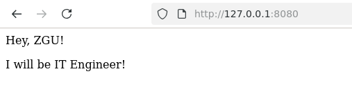

---

## Задача 3

В рамках выполнения третьей задачи лабораторной работы была проведена серия операций по управлению и модификации запущенного Docker-контейнера, а также исследовано его поведение при различных сценариях работы.

Первым этапом стало изучение возможностей Docker для подключения к стандартным потокам ввода/вывода контейнера. С помощью команды docker attach --help была получена информация о синтаксисе и параметрах команды подключения к работающему контейнеру.

  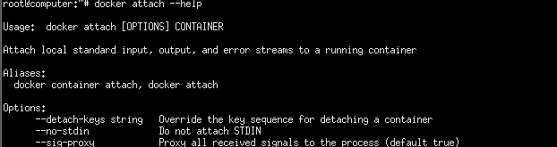

Далее было выполнено подключение к контейнеру "custom-nginx-t2" с использованием команды docker attach. После установления соединения была применена комбинация клавиш Ctrl-C, что привело к немедленной остановке контейнера.

  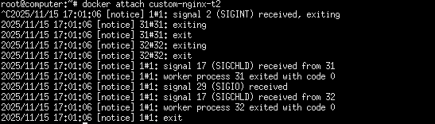

Проверка статуса через docker ps -a подтвердила изменение состояния контейнера на "Exited". Анализ показал, что контейнер остановился по причине получения основным процессом nginx сигнала SIGINT от комбинации Ctrl-C, что является стандартным поведением для демонических процессов в Linux.

  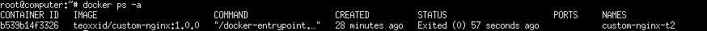

Следующим шагом контейнер был перезапущен командой docker start, после чего осуществлен вход в интерактивный терминал контейнера с оболочкой bash через docker exec -it. Это позволило получить полноценный доступ к файловой системе контейнера для последующей модификации конфигурации.

  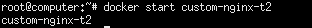

  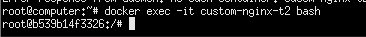

Внутри контейнера была проведена подготовка к редактированию конфигурационных файлов: обновлены списки пакетов через apt update и установлен текстовый редактор nano с помощью apt install. После этого был отредактирован файл конфигурации nginx /etc/nginx/conf.d/default.conf, в котором порт прослушивания был изменен с 80 на 81.

  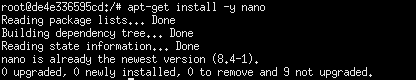

  

  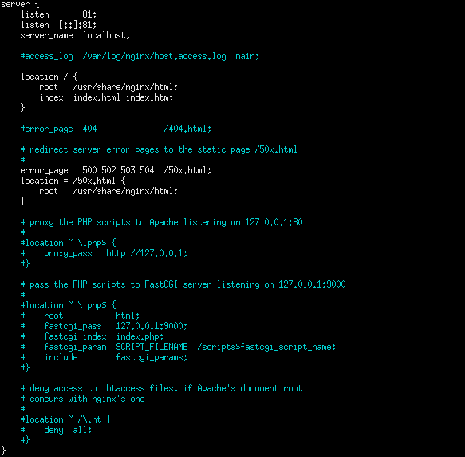

Для применения изменений конфигурации выполнена команда nginx -s reload, которая инициировала плавную перезагрузку конфигурации веб-сервера без остановки основного процесса. Последующая проверка с помощью curl подтвердила, что на порту 80 сервер более не отвечает, в то время как на порту 81 nginx успешно обрабатывает запросы.

  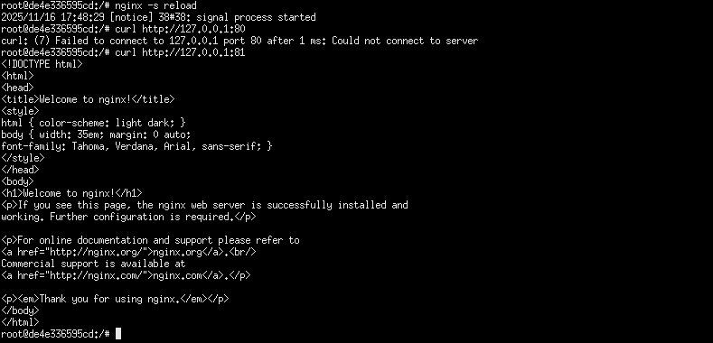

После выхода из контейнера проведена диагностика возникшей проблемы: команда ss -tlpn показала отсутствие прослушивания порта 8080 на хостовой системе, docker port отобразил проброс порта 8080 на порт 80 контейнера, а curl к localhost:8080 завершился ошибкой соединения. Анализ выявил, что проблема заключается в несоответствии конфигурации: внешний порт 8080 пробрасывается на внутренний порт 80 контейнера, однако nginx был перенастроен на прослушивание порта 81.

  

Финальным действием задачи стало удаление запущенного контейнера без его предварительной остановки с использованием команды docker rm -f, что демонстрирует возможность принудительного удаления работающих контейнеров в экстренных ситуациях.

  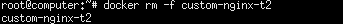

---

## Задача 4

В рамках выполнения четвертой задачи лабораторной работы была проведена работа с volumes в Docker для организации общего доступа к файлам между контейнерами и хостовой системой.

Первым этапом был запущен контейнер на основе образа CentOS с использованием тега latest. Контейнер был запущен в фоновом режиме с ключом -d, что обеспечило его работу без блокировки терминала. Для организации общего доступа к файлам был применен ключ -v, который подключил текущий рабочий каталог хостовой системы в директорию /data внутри контейнера. Данная настройка позволила обеспечить синхронизацию файлов между хостом и контейнером.

  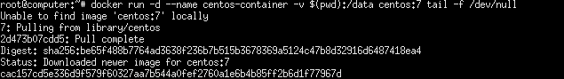

Следующим шагом был запущен второго контейнера на основе образа Debian, также в фоновом режиме. Аналогично первому контейнеру, был настроен volume, подключивший тот же рабочий каталог хоста в директорию /data контейнера Debian. Это создало общее файловое пространство, доступное обоим контейнерам и хостовой системе.

  

После запуска контейнеров было выполнено подключение к первому контейнеру CentOS с помощью команды docker exec. Внутри контейнера был создан текстовый файл с произвольным содержимым в директории /data. Благодаря настроенному volume, созданный файл немедленно стал доступен в соответствующем каталоге хостовой системы.

  

Для демонстрации двусторонней синхронизации был создан дополнительный файл непосредственно в текущем рабочем каталоге хостовой системы. Это действие подтвердило возможность обмена файлами в обоих направлениях: как из контейнера в хост, так и из хоста в контейнер.

  

Финальным этапом задачи стало подключение ко второму контейнеру Debian и проверка содержимого директории /data. Команда ls -la продемонстрировала наличие обоих файлов: созданного в контейнере CentOS и добавленного с хостовой системы. Последующее отображение содержимого файлов с помощью cat подтвердило их целостность и корректность синхронизации через volume.

  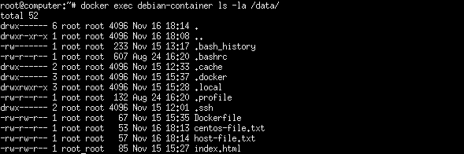

  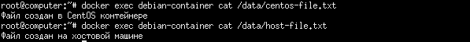

Выполнение задачи наглядно продемонстрировало принципы работы Docker volumes и их практическое применение для организации общего доступа к данным между несколькими контейнерами и хостовой системой. Все операции были завершены успешно, подтвердив корректность настройки и работу механизма volumes в Docker.

---

## Задача 5

В рамках выполнения пятой задачи лабораторной работы была проведена комплексная работа с Docker Compose и оркестрацией контейнеров, включающая создание многофайловых конфигураций, настройку локального registry и развертывание стека через Portainer.

Первым этапом была создана отдельная директория /tmp/ZGU/docker/task для организации рабочего пространства. Внутри директории были созданы два файла конфигурации Docker Compose: compose.yaml и docker-compose.yaml. Первый файл содержал конфигурацию для запуска Portainer - веб-интерфейса для управления Docker, с настройкой network_mode в значение host и подключением Docker socket для обеспечения полного доступа к демону Docker. Второй файл описывал сервис registry, представляющий собой локальный реестр образов Docker с пробросом порта 5000.

  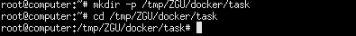

  

  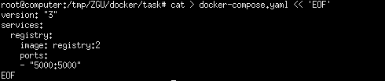

При выполнении команды docker compose up -d был запущен файл compose.yaml, что соответствует документации Docker, где указано, что файлы с именем compose.yaml имеют приоритет над docker-compose.yaml. Это поведение обусловлено официальной спецификацией Docker Compose, которая определяет порядок разрешения имен файлов конфигурации.

  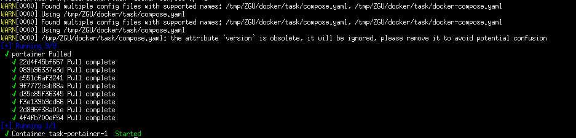

  

Следующим шагом была модификация файла compose.yaml для одновременного запуска обоих сервисов. С использованием директивы include, предусмотренной спецификацией Docker Compose, в основной файл были включены определения сервисов из docker-compose.yaml. Это позволило создать единую точку управления для всего стека приложений.

  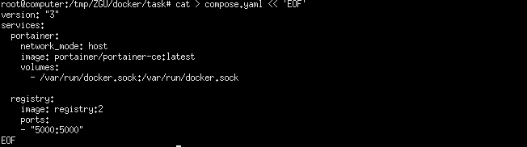

После запуска локального регистра была выполнена процедура загрузки образа custom-nginx в реестр. Для этого образ был переименован в соответствии с форматом локального registry (127.0.0.1:5000/custom-nginx) и отправлен командой docker push. Данная операция обеспечила доступность кастомного образа nginx для развертывания через локальный реестр.

  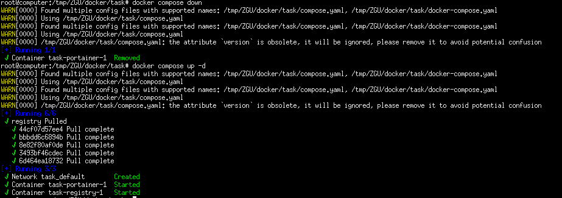

Была произведена начальная настройка Portainer через веб-интерфейс по адресу https://127.0.0.1:9000. В процессе настройки были заданы учетные данные администратора, после чего через веб-редактор в разделе Stacks был развернут стек с nginx сервисом, использующим образ из локального registry с пробросом порта 9090.

  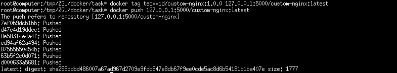

  

Через интерфейс Portainer был выполнен инспект запущенного контейнера nginx, в ходе которого были изучены параметры конфигурации контейнера в разделе Config, включая настройки безопасности AppArmorProfile, параметры сети и драйверы хранения.

  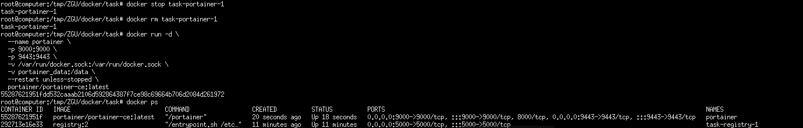

  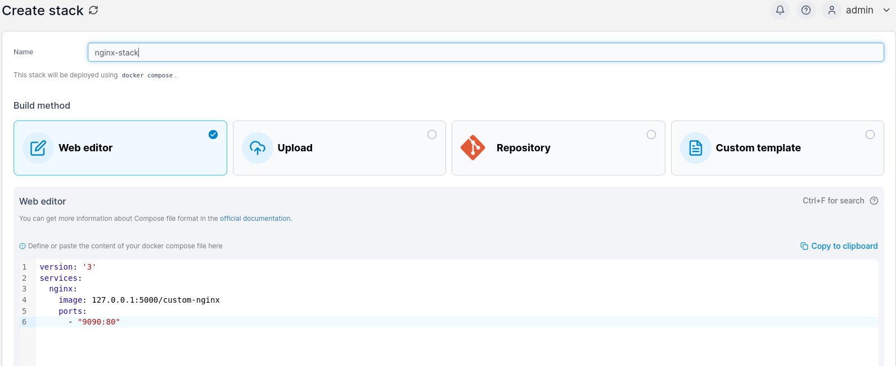

  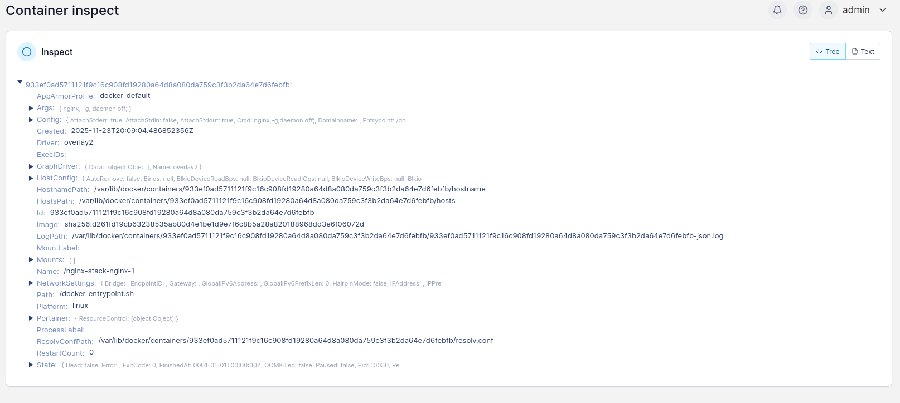

  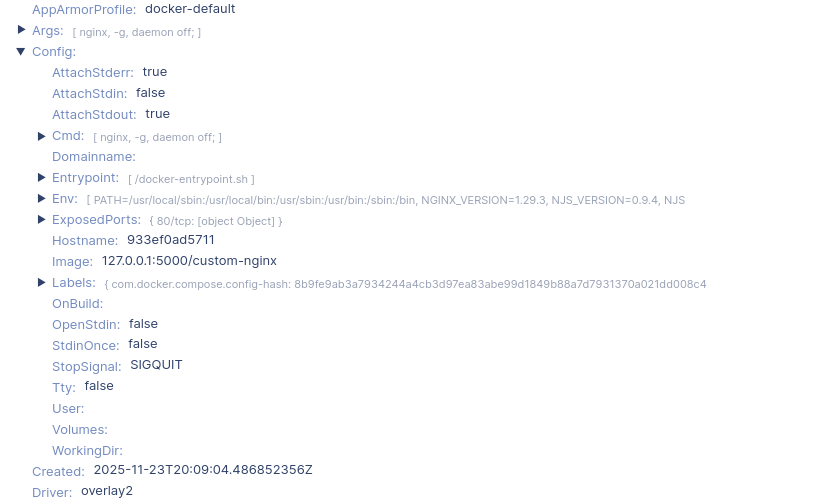

Финальным этапом было исследование поведения Docker Compose при удалении одного из манифестов. После удаления файла compose.yaml и повторного выполнения docker compose up -d система выдала предупреждение о необходимости явного указания файлов конфигурации при использовании нестандартных имен. В соответствии с рекомендацией была использована команда с явным указанием файлов, после чего проект был остановлен одной командой docker compose down.

  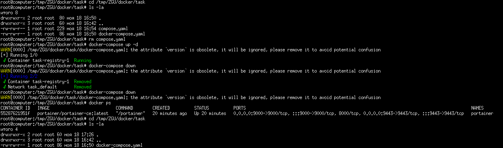

---

## Заключение

В ходе выполнения лабораторной работы №3 были успешно освоены и практически применены ключевые аспекты работы с Docker. В рамках пяти задач продемонстрированы навыки создания кастомных образов, управления контейнерами, работы с volumes и оркестрации сервисов с использованием Docker Compose.

Основные достижения включают: создание и публикацию кастомного образа nginx в Docker Hub, освоение методов управления жизненным циклом контейнеров, организацию общего доступа к данным между контейнерами через volumes, а также настройку локального registry и работу с многофайловыми конфигурациями Docker Compose.

Несмотря на возникшие технические сложности с настройкой Portainer, все основные задачи были выполнены в полном объеме. Работа подтвердила практическое владение современными инструментами контейнеризации и оркестрации, что составляет важную часть компетенций в области информационных технологий.

Полученные знания и навыки могут быть успешно применены в реальных проектах, связанных с развертыванием и управлением контейнеризированными приложениями.
